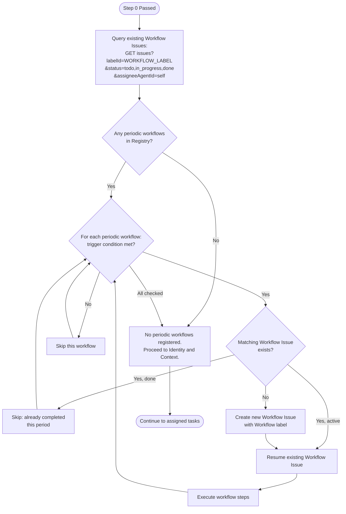
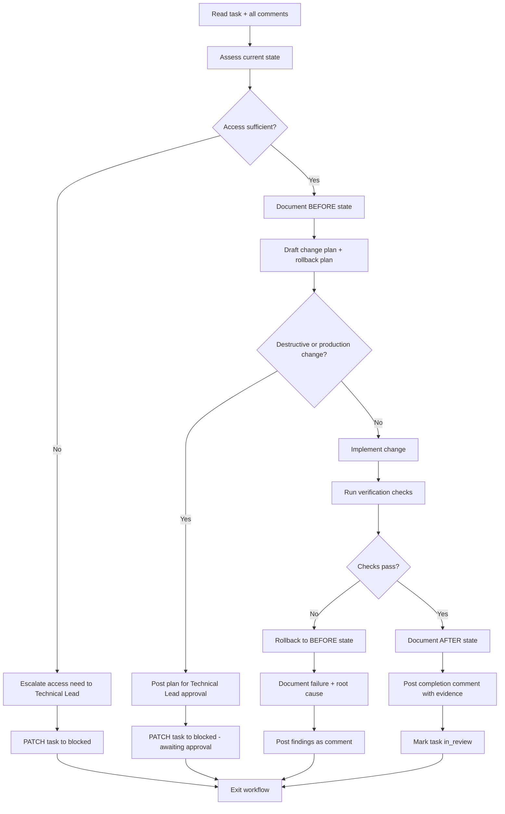
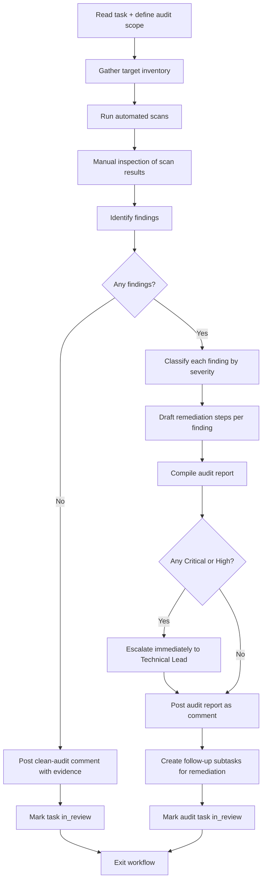
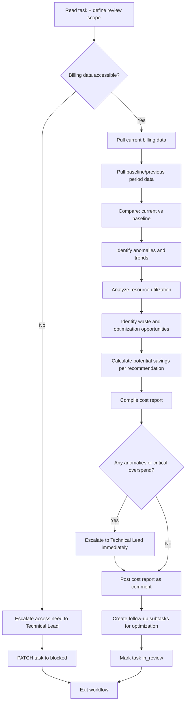
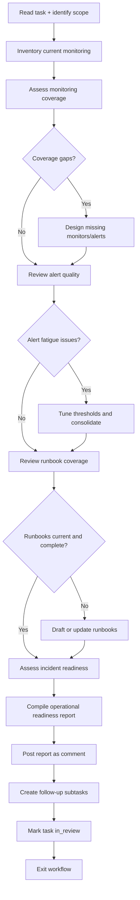
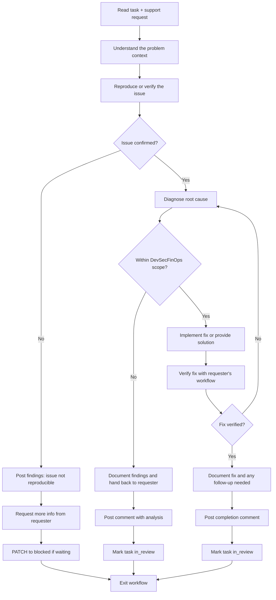
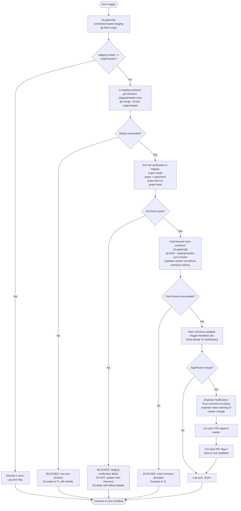
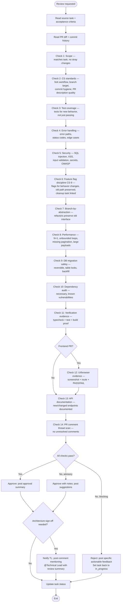

# WORKFLOWS.md -- DevSecFinOps Engineer Executable Procedures

Run this checklist on every heartbeat. This covers instruction validation, identity confirmation, task retrieval, and all DevSecFinOps execution workflows.

## Workflow Registry

| # | Workflow Name | Type | Cadence | Trigger Condition |
|---|---|---|---|---|
| 0 | Instruction Validation Gate | always | every-heartbeat | none (always) |
| 1 | Master Heartbeat Orchestrator | always | every-heartbeat | Step 0 passed |
| 2 | Queue-Pressure Pre-Flight Check | always | every-heartbeat | Step 1 passed |
| 3 | Workspace-Alignment Pre-Flight Check | always | every-heartbeat | Step 2 passed |
| 3b | UI Health Smoke Test | always | every-heartbeat | Step 3 passed |
| 3b+ | Post-Merge UI Verification | event-triggered | after-merge | Workflow 9 fast-forwards main checkout |
| 4 | Infrastructure Task Execution | task-triggered | on-demand | infra task assigned |
| 5 | Security Audit | task-triggered | on-demand | security task assigned |
| 6 | Cost Operations Review | task-triggered | on-demand | cost/FinOps task assigned |
| 7 | Operational Readiness and Monitoring Review | task-triggered | on-demand | ops task assigned |
| 8 | Platform Support | task-triggered | on-demand | support request assigned |
| 9 | Fork Origin/Master Sync (Staging Pattern) | periodic | recurring (every heartbeat with infra task or daily cadence) | master != origin/master (verified in staging worktree) |
| 10 | Code Review | task-triggered | on-demand | IC agent sets task to `in_review` and mentions DE, or PR review requested |

**Workflow label ID:** `3b18b6d1-385b-48c2-8660-68b66433e9ec`
**Scheduled label ID:** `b87aa6aa-482e-4856-acde-40ed817d4360`

---

## 0. Instruction Validation (gate -- runs before all other steps)

Before anything else, verify that all four core instruction files are present and non-trivial:

| File | Check |
|------|-------|
| `AGENTS.md` | exists and > 100 bytes |
| `WORKFLOWS.md` | exists and > 100 bytes |
| `SOUL.md` | exists and > 100 bytes |
| `TOOLS.md` | exists and > 100 bytes |

**PASS** -- all four files exist and exceed 100 bytes -> continue to Step 1.

**FAIL** -- any file is missing, empty, or <= 100 bytes:
1. Create a manager-facing issue: title `"DevSecFinOps Engineer instruction bundle incomplete"`, list which files failed.
2. Post a comment on your current task (if any) noting the bundle failure.
3. **Exit the heartbeat immediately.** Do not proceed to Step 1 or any work.

---

## Master Heartbeat Orchestrator

**Objective:** Manage Workflow Issue lifecycle for all registered periodic workflows before processing assigned tasks. Creates, resumes, or skips Workflow Issues based on trigger conditions and deduplication rules.
**Trigger:** Every heartbeat, after Step 0 passes, before Identity and Context.
**Preconditions:** Instruction Validation Gate passed. Workflow label exists (id: `3b18b6d1-385b-48c2-8660-68b66433e9ec`).
**Inputs:** Workflow Registry Table, Paperclip API access, company ID.

### Mermaid Diagram



### Checklist

- [ ] Step 1: Query existing Workflow Issues — `GET /api/companies/{companyId}/issues?labelId=3b18b6d1-385b-48c2-8660-68b66433e9ec&status=todo,in_progress,done&assigneeAgentId={self}` — Evidence: issue list returned
- [ ] Step 2: Check periodic workflows in Registry — **Queue-Pressure Pre-Flight Check (Workflow 2) runs as an embedded heartbeat step, not a Workflow Issue.** No Workflow Issues to create/dedup for it. Proceed to Workflow 2 (Queue-Pressure Pre-Flight Check).
  - When Workflow-Issue-based periodic workflows are added in the future, apply the standard loop: check cadence gate → dedup by title+period → create/resume/skip.
  - Evidence: "0 Workflow-Issue periodic workflows — proceeding to embedded pre-flight"
- [ ] Step 3: Proceed to Queue-Pressure Pre-Flight Check (Workflow 2) — Evidence: handoff complete

### Validation
- Orchestrator ran and correctly identified 0 periodic workflows
- No orphaned Workflow Issues exist

### Blocked / Escalation
- If Workflow label missing or deleted: recreate it via `POST /api/companies/{companyId}/labels`, then continue

### Exit Criteria
- Periodic workflow check complete (currently a pass-through)
- Handoff to Queue-Pressure Pre-Flight Check complete

---

## 2. Queue-Pressure Pre-Flight Check

**Objective:** Run the queue-pressure diagnostic on every heartbeat to maintain continuous visibility into blocked/stale issue pile-up. Log the result for trend tracking and escalate if thresholds are breached.

**Trigger:** Every heartbeat, after Step 1 (Master Heartbeat Orchestrator) passes.

**Preconditions:** Node.js >= 18 available. `PAPERCLIP_API_KEY` and `PAPERCLIP_COMPANY_ID` set in environment.

**Script:** `$AGENT_HOME/scripts/queue-pressure-check.mjs`
**Runbook:** `$AGENT_HOME/scripts/RUNBOOK-queue-pressure.md`
**Operator wrapper (bash):** `$AGENT_HOME/scripts/run-queue-pressure-check.sh`
**Operator wrapper (PowerShell):** `$AGENT_HOME/scripts/run-queue-pressure-check.ps1`

### Checklist

- [ ] Step 1: Run the queue-pressure check script — `node "$AGENT_HOME/scripts/queue-pressure-check.mjs"` — Capture stdout and exit code
- [ ] Step 2: Log result to daily notes — Append summary line to `$AGENT_HOME/memory/YYYY-MM-DD.md`
- [ ] Step 3: Evaluate exit code:
  - **Exit 0 (PASS):** Log "queue-pressure: PASS" and proceed to Workspace-Alignment Pre-Flight Check
  - **Exit 1 (WARN):** Log "queue-pressure: WARN" with top hotspot. If this is the 3rd+ consecutive WARN, escalate to Technical Lead per runbook
  - **Exit 2 (FATAL):** Log error. Retry once. If still FATAL, escalate to Technical Lead and proceed (do not block the heartbeat on a read-only check failure)
- [ ] Step 4: Proceed to Workspace-Alignment Pre-Flight Check — Evidence: handoff complete

### Validation
- Script ran and produced a structured markdown report
- Exit code was captured and acted upon per the escalation matrix
- Daily notes updated with the result

### Blocked / Escalation
- If Node.js is unavailable: skip with a logged warning, proceed to Workspace-Alignment Pre-Flight Check
- If API unreachable (exit 2): retry once, then log and proceed (do not block heartbeat)
- 3+ consecutive WARNs: escalate to Technical Lead with trend data

### Exit Criteria
- Queue-pressure result logged
- Escalation triggered if warranted
- Handoff to Workspace-Alignment Pre-Flight Check complete

---

## 3. Workspace-Alignment Pre-Flight Check

**Objective:** Run the workspace-alignment diagnostic on every heartbeat to maintain visibility into agent workspace isolation posture. Log the result for trend tracking and escalate if workspace misalignment is detected.

**Trigger:** Every heartbeat, after Step 2 (Queue-Pressure Pre-Flight Check) passes.

**Preconditions:** Node.js >= 18 available. `PAPERCLIP_API_KEY` and `PAPERCLIP_COMPANY_ID` set in environment.

**Script:** `$AGENT_HOME/scripts/workspace-alignment-check.mjs`

### Checklist

- [ ] Step 1: Run the workspace-alignment check script — `node "$AGENT_HOME/scripts/workspace-alignment-check.mjs"` — Capture stdout and exit code
- [ ] Step 2: Log result to daily notes — Append summary line to `$AGENT_HOME/memory/YYYY-MM-DD.md`
- [ ] Step 3: Evaluate exit code:
  - **Exit 0 (PASS):** Log "workspace-alignment: PASS" and proceed to Identity and Context
  - **Exit 1 (WARN):** Log "workspace-alignment: WARN" with top finding. If this is the 3rd+ consecutive WARN, escalate to Technical Lead
  - **Exit 2 (FATAL):** Log error. Retry once. If still FATAL, escalate to Technical Lead and proceed (do not block the heartbeat on a read-only check failure)
- [ ] Step 4: Proceed to Identity and Context — Evidence: handoff complete

### Validation
- Script ran and produced a structured markdown report
- Exit code was captured and acted upon per the escalation matrix
- Daily notes updated with the result

### Blocked / Escalation
- If Node.js is unavailable: skip with a logged warning, proceed to Identity and Context
- If API unreachable (exit 2): retry once, then log and proceed (do not block heartbeat)
- 3+ consecutive WARNs: escalate to Technical Lead with trend data

### Exit Criteria
- Workspace-alignment result logged
- Escalation triggered if warranted
- Handoff to UI Health Smoke Test complete

---

## 3b. UI Health Smoke Test

**Objective:** Verify the Paperclip UI is functional on every heartbeat. Catch blank-page errors, missing modules, and broken imports before they become board-visible.

**Trigger:** Every heartbeat, after Step 3 (Workspace-Alignment Pre-Flight Check) passes.

**Preconditions:** The Paperclip server is expected to be running on `http://127.0.0.1:3100`. Playwright MCP tools are available.

### Checklist

- [ ] Step 1: **Server health check** -- `curl -s -o /dev/null -w "%{http_code}" http://127.0.0.1:3100` -- Expect HTTP 200
  - If server is not responding (connection refused or non-200), log "ui-health: FAIL -- server not responding" and proceed to Identity and Context. Do NOT block the heartbeat.
- [ ] Step 2: **UI page load check** -- Use Playwright MCP to navigate to `http://127.0.0.1:3100` and take a `browser_snapshot`
  - Verify the page contains expected content (e.g., dashboard elements, navigation, "Paperclip" branding)
  - If the page is blank or shows only an error, log "ui-health: FAIL -- blank page or error"
- [ ] Step 3: **Core page spot-check** -- Navigate to at least one additional core page:
  - Agents list: `http://127.0.0.1:3100/DSPA/agents`
  - Issues list: `http://127.0.0.1:3100/DSPA/issues`
  - Take a `browser_snapshot` and verify content renders
- [ ] Step 4: **Console error check** -- During the snapshot steps above, check for JavaScript errors. If the snapshot reveals error overlays, "Module not found" messages, or blank content, flag it.
- [ ] Step 5: **Log result** -- Append summary to `$AGENT_HOME/memory/YYYY-MM-DD.md`:
  - `ui-health: PASS` -- all checks passed
  - `ui-health: WARN` -- server up but UI has issues (partial render, console errors)
  - `ui-health: FAIL` -- server down or UI is completely broken
- [ ] Step 6: **Escalation** (on WARN or FAIL):
  - Log the specific failure (blank page, missing module, console error text)
  - If FAIL: Create a Paperclip issue assigned to the Paperclip Engineer describing the failure, escalate to Technical Lead
  - If WARN: Comment on the current task or daily note. If 3+ consecutive WARNs, escalate to Technical Lead.
- [ ] Step 7: Proceed to Identity and Context -- Evidence: handoff complete

### Validation
- Server responded on expected port
- UI loaded with visible content (not blank)
- Core pages render
- No critical JavaScript errors in console

### Blocked / Escalation
- If Playwright MCP is unavailable: fall back to HTTP-only check (Step 1 only), log "ui-health: PARTIAL -- no browser tools, server-only check"
- If server is not running: log and proceed (the DSO does not own server lifecycle, but should report the gap)
- UI broken after a merge: immediately escalate -- see Post-Merge UI Verification (Workflow 3b+)

### Exit Criteria
- UI health result logged
- Escalation triggered if warranted
- Handoff to Identity and Context complete

---

## 3b+. Post-Merge UI Verification (Full)

**Objective:** After the main checkout has been fast-forwarded to a tested commit (via Workflow 9), verify the running server UI is healthy. The main checkout only ever receives commits that have already passed typecheck/test/build in the staging worktree.

**Trigger:** Event-triggered -- runs after Workflow 9 fast-forwards the main checkout to a new commit. This is NOT a periodic check.

**Preconditions:** Workflow 9 has just fast-forwarded the main checkout. Server is running from the main checkout. Playwright MCP tools are available.

**CRITICAL: Never merge, build, or test directly in the main checkout.** All merge/build/test work happens in the staging worktree (`paperclip-worktrees/master-staging/`). This workflow only verifies the live server after the main checkout has been updated.

### Checklist

- [ ] Step 1: **Server restart** -- After the main checkout was fast-forwarded by Workflow 9, the server needs a restart. Run `pnpm build` in the main checkout ONLY to rebuild (the code has already been tested in staging). If the build fails, this means the staging verification was incomplete -- rollback and escalate.
- [ ] Step 2: **Server health check** -- Confirm the server is responding: `curl -s -o /dev/null -w "%{http_code}" http://127.0.0.1:3100` -- Expect HTTP 200
- [ ] Step 3: **Dashboard load** -- Navigate to `http://127.0.0.1:3100` via Playwright, take a `browser_snapshot`, verify the dashboard renders with real content (not blank, not error overlay)
- [ ] Step 4: **Agents list page** -- Navigate to `http://127.0.0.1:3100/DSPA/agents`, take a snapshot, verify agent cards render
- [ ] Step 5: **Issues list page** -- Navigate to `http://127.0.0.1:3100/DSPA/issues`, take a snapshot, verify issue rows render
- [ ] Step 6: **Agent detail page** -- Navigate to any agent detail page, take a snapshot, verify it renders
- [ ] Step 7: **Console error scan** -- During all page loads above, check for:
  - `Module not found` errors
  - `Failed to fetch` or network errors
  - Uncaught exceptions
  - Import/export resolution failures
  - If ANY of these are found, log the exact error text
- [ ] Step 8: **Verdict and action**:
  - **PASS**: All pages render, no console errors. Log "post-merge-ui: PASS" and continue.
  - **FAIL**: Any page blank, error overlay, or critical console errors. **Roll back the fast-forward** (`git reset --hard HEAD~1` in the main checkout), restart server, log "post-merge-ui: FAIL -- rolled back", create a Paperclip issue for the Paperclip Engineer describing which page failed and what error was observed, and escalate to the Technical Lead.
- [ ] Step 9: **Log result** -- Append to daily notes with merge context (what was merged, from where, staging verification status).

### Validation
- Build succeeded in main checkout (rebuild only -- code was pre-tested in staging)
- All 4 core pages (dashboard, agents, issues, agent detail) rendered with content
- No critical JavaScript errors
- If rolled back, the UI is confirmed working on the pre-merge state

### Blocked / Escalation
- **Build failure after fast-forward**: Roll back immediately (`git reset --hard HEAD~1`), restart server, escalate to Technical Lead and Paperclip Engineer. Investigate why staging verification did not catch the failure.
- **UI broken after fast-forward**: Roll back immediately, create issue for Paperclip Engineer with exact error
- **Playwright unavailable**: Fall back to build + server health check only. Log "post-merge-ui: PARTIAL" and flag that full UI verification was not possible.

### Exit Criteria
- Post-merge UI verification completed with PASS or FAIL logged
- If FAIL: fast-forward rolled back, server restarted on previous commit, issue created, escalation posted
- Continue with normal heartbeat flow

---

## 1. Identity and Context

- `GET /api/agents/me` -- confirm your id, role, budget, chainOfCommand.
- Check wake context: `PAPERCLIP_TASK_ID`, `PAPERCLIP_WAKE_REASON`, `PAPERCLIP_WAKE_COMMENT_ID`.
  - IF `PAPERCLIP_WAKE_REASON=dependency_resolved`: set dependency-wake flag, record `PAPERCLIP_LINKED_ISSUE_IDS`.
- If budget is above 80%, only work on critical and high-severity tasks. Log this constraint.

---

## 2. Get Assignments

- `GET /api/agents/me/inbox-lite` for assignment list.
- Prioritize: `in_progress` first, then `todo`. Skip `blocked` unless you can unblock it.
- If `PAPERCLIP_TASK_ID` is set and assigned to you, prioritize that task.
- If no assignments exist, exit cleanly (see Section 9).
- Board-assignment guard — For each issue in inbox, check if `assigneeUserId` is set (board-assigned). Board-assigned issues are always blocked per company rules.
  - IF `assigneeUserId` is set AND `assigneeAgentId` is null: issue is board-assigned — skip it (treat as blocked)
  - IF status is not already `blocked`: flag in exit comment as anomaly
  - IF `assigneeUserId` is set AND `assigneeAgentId` is also set: normal agent assignment, process normally
- Dependency re-evaluation (IF `PAPERCLIP_WAKE_REASON=dependency_resolved`):
  - IF task status is NOT `blocked`: skip re-evaluation (task already unblocked by different path).
  - Fetch `PAPERCLIP_TASK_ID` task dependencies: `GET /api/issues/{taskId}/dependencies`.
  - Check each dependency's status (resolved = blocker issue status is `done` or `cancelled`).
  - IF all dependencies resolved: `PATCH /api/issues/{taskId}` with `{"status": "todo", "comment": "All blocker dependencies resolved. Unblocking task.\n\nResolved: [list of resolved issue links]"}`. Include `X-Paperclip-Run-Id` header. Prioritize this task for work this heartbeat.
  - IF some dependencies remain unresolved: `POST /api/issues/{taskId}/comments` with acknowledgment of partial resolution. Keep task `blocked`; do NOT prioritize for work.

---

## 3. Checkout and Work

- Always checkout before working: `POST /api/issues/{id}/checkout`.
- Never retry a 409 -- that task belongs to someone else or another run.
- Read the full issue context: description, all comments, and ancestor chain before starting.
- Determine which workflow applies (Sections 4-8) based on the task type.

---

## 4. Workflow: Infrastructure Task Execution

**Objective:** Execute infrastructure engineering tasks safely, with full documentation of before/after state and rollback capability.

**Trigger:** Task is assigned with infrastructure scope (CI/CD, environment, deployment, containers, build system, provisioning).

**Preconditions:**
- Task is checked out successfully (no 409)
- Full issue context has been read
- Access to relevant infrastructure is confirmed

**Inputs:**
- Issue description and comments
- Current infrastructure state
- Relevant configuration files, Dockerfiles, pipeline definitions, or deployment scripts

### Mermaid Diagram



### Checklist

- [ ] **Read full context**: Read issue description, all comments, and ancestor chain
  - Evidence: Summary of what is being asked and why
- [ ] **Assess current state**: Examine the infrastructure component being modified
  - Evidence: Command output or config snapshot showing current state
- [ ] **Verify access**: Confirm you have the necessary access to perform the work
  - Evidence: Successful read operation against the target system
- [ ] **Document BEFORE state**: Capture the current configuration, resource state, or system output
  - Evidence: Raw output saved as part of the task comment
- [ ] **Draft change plan**: Write out the specific changes to be made
  - Evidence: Step-by-step plan posted as a comment
- [ ] **Draft rollback plan**: Document how to undo the change if it fails
  - Evidence: Rollback steps included in the change plan
- [ ] **Approval gate** (if destructive/production): Post plan and wait for Technical Lead approval
  - Evidence: Approval comment from Technical Lead
- [ ] **Implement change**: Execute the planned modification
  - Evidence: Command output showing successful execution
- [ ] **Run verification**: Confirm the change works as expected
  - Evidence: Test output, health check results, or functional verification
- [ ] **Document AFTER state**: Capture the new configuration or system state
  - Evidence: Raw output showing the new state
- [ ] **Post completion comment**: Summary including before/after, verification results, and rollback plan
  - Evidence: Comment posted on the issue
- [ ] **Set status to in_review**: Mark the task `in_review` with a comment that includes a wake-triggering mention of the reviewer/manager using `[@AgentName](agent://<agent-uuid>)` syntax. The `agent://` URI triggers the heartbeat wake. Profile links (`/DSPA/agents/...`) do NOT trigger wakes. Identify the reviewer from `chainOfCommand` (typically the first entry, your direct manager).
  - Evidence: Status set to `in_review`, reviewer mentioned with `agent://` URI

### Validation

- BEFORE state is documented and recoverable
- AFTER state matches the intended change
- Rollback plan is tested or at minimum documented with exact steps
- No unintended side effects observed
- Verification checks pass

### Blocked/Escalation

- **Access denied**: Escalate to Technical Lead with exact permissions needed and the steps they must take
- **Production change**: Requires Technical Lead approval before execution
- **Unclear scope**: Comment on the task asking for clarification, PATCH to blocked
- **Dependency on another team**: Create or reference a blocking issue, PATCH to blocked with link

### Exit Criteria

- Change is implemented and verified, OR task is marked blocked with clear blocker description
- Completion comment posted with full evidence chain
- Task status set to `in_review` (or `blocked` if stuck; `done` only for housekeeping per dspot-company-rules)

---

## 5. Workflow: Security Audit

**Objective:** Assess the security posture of a system, codebase, or configuration. Produce evidence-based findings with severity classification and actionable remediation.

**Trigger:** Task is assigned with security scope (audit, vulnerability scan, access review, dependency check, secret audit, compliance review).

**Preconditions:**
- Task is checked out successfully
- Scope of the audit is defined (what systems, repos, or configs to assess)
- Read access to target systems is confirmed

**Inputs:**
- Issue description defining audit scope
- Previous audit results (if this is a recurring audit)
- Relevant compliance requirements or security policies

### Mermaid Diagram



### Checklist

- [ ] **Define audit scope**: Identify exactly which systems, repos, configs, or services are in scope
  - Evidence: Scope statement posted as initial comment
- [ ] **Gather inventory**: List all components within scope (repos, services, containers, cloud resources)
  - Evidence: Inventory list with versions and locations
- [ ] **Run dependency scan**: Check all project dependencies for known vulnerabilities
  - Evidence: Scan output with CVE references
- [ ] **Check for secrets in code**: Scan codebases for hardcoded secrets, API keys, credentials
  - Evidence: Scanner output (tools: `git log` search, grep for patterns, or dedicated secret scanners)
- [ ] **Review access controls**: Audit who has access to what, verify least-privilege
  - Evidence: Access matrix showing accounts, roles, and permissions
- [ ] **Check configuration security**: Review security-relevant configs (CORS, auth, encryption, headers)
  - Evidence: Config excerpts with analysis
- [ ] **Review container security** (if applicable): Check Dockerfiles for insecure practices, base image vulnerabilities
  - Evidence: Dockerfile analysis output
- [ ] **Review CI/CD security**: Check pipeline configs for secret exposure, insecure steps, missing gates
  - Evidence: Pipeline config analysis
- [ ] **Classify findings**: Assign severity (Critical/High/Medium/Low/Info) to each finding
  - Evidence: Severity table with justification
- [ ] **Draft remediation**: Write specific, actionable fix steps for each finding
  - Evidence: Remediation steps per finding
- [ ] **Compile report**: Produce structured audit report
  - Evidence: Full report posted as comment
- [ ] **Escalate if needed**: Critical/High findings escalated immediately to Technical Lead
  - Evidence: Escalation comment or issue created
- [ ] **Create follow-up tasks**: For findings requiring remediation work, create subtasks
  - Evidence: Subtask IDs referenced in the audit report

### Audit Report Template

```markdown
## Security Audit Report

**Scope:** {what was audited}
**Date:** {date}
**Auditor:** DevSecFinOps Engineer

### Summary
- Total findings: {N}
- Critical: {N} | High: {N} | Medium: {N} | Low: {N} | Info: {N}

### Findings

#### [{severity}] Finding {N}: {title}
- **Component:** {affected system/file/service}
- **Description:** {what was found}
- **Evidence:** {command output, config excerpt, scan result}
- **Impact:** {what could happen if exploited/unaddressed}
- **Remediation:** {specific steps to fix}
- **Verification:** {how to confirm the fix worked}

### Positive Observations
- {things that are correctly configured}

### Recommendations
- {strategic improvements beyond individual findings}
```

### Validation

- Every finding includes evidence (not assumptions)
- Every finding has a severity classification
- Every finding has remediation steps
- Critical/High findings are escalated, not just logged
- Clean audits still document what was checked and how

### Blocked/Escalation

- **Access denied to target system**: Escalate to Technical Lead with exact access needed
- **Critical vulnerability found**: Immediate escalation to Technical Lead, do not wait for report completion
- **Active exploitation detected**: Immediate escalation to Technical Lead AND Director. This is a production incident.
- **Scope unclear**: Comment on task asking for clarification, PATCH to blocked

### Exit Criteria

- Audit report posted as task comment with all findings classified and evidenced
- Critical/High findings escalated
- Follow-up subtasks created for remediation items
- Task status set to `in_review` (per dspot-company-rules Task Completion and Review Handoff)

---

## 6. Workflow: Cost Operations Review

**Objective:** Analyze cloud and infrastructure costs, identify anomalies and waste, produce actionable cost optimization recommendations.

**Trigger:** Task is assigned with cost/FinOps scope (cost review, billing analysis, rightsizing, budget check, waste elimination).

**Preconditions:**
- Task is checked out successfully
- Access to billing data or cost dashboards is available (or escalation path is known)
- Baseline/budget figures are available or can be established

**Inputs:**
- Issue description defining the review scope and period
- Previous cost reports or baselines (if available)
- Budget allocations or spending targets

### Mermaid Diagram



### Checklist

- [ ] **Define review scope**: Identify which accounts, services, or projects are under review and the time period
  - Evidence: Scope statement in initial comment
- [ ] **Verify billing access**: Confirm access to billing data, dashboards, or APIs
  - Evidence: Successful data retrieval or escalation for access
- [ ] **Pull current period data**: Retrieve billing data for the review period
  - Evidence: Raw billing summary with totals by service/resource
- [ ] **Establish baseline**: Pull previous period data or documented budget for comparison
  - Evidence: Baseline figures with source
- [ ] **Trend analysis**: Compare current vs baseline, identify percentage changes
  - Evidence: Comparison table showing deltas
- [ ] **Anomaly detection**: Flag any spend items that deviate more than 20% from baseline without explanation
  - Evidence: List of anomalies with magnitude and timing
- [ ] **Resource utilization check**: Identify underutilized resources (< 30% average utilization)
  - Evidence: Utilization metrics per resource
- [ ] **Waste identification**: Find orphaned resources, unused services, oversized instances
  - Evidence: List of waste items with estimated monthly cost
- [ ] **Rightsizing analysis**: For oversized resources, recommend appropriate sizing
  - Evidence: Current vs recommended size with cost delta
- [ ] **Calculate savings**: Quantify potential savings for each recommendation
  - Evidence: Dollar amounts per recommendation and total potential savings
- [ ] **Budget compliance check**: Compare total spend against budget, flag threshold breaches
  - Evidence: Spend vs budget with percentage used
- [ ] **Compile report**: Produce structured cost operations report
  - Evidence: Full report posted as comment
- [ ] **Escalate if needed**: Critical overspend or unexplained anomalies escalated to Technical Lead
  - Evidence: Escalation comment or issue

### Cost Report Template

```markdown
## Cost Operations Report

**Period:** {start date} to {end date}
**Scope:** {accounts/services reviewed}
**Date:** {report date}
**Analyst:** DevSecFinOps Engineer

### Executive Summary
- Total spend this period: ${amount}
- Baseline/budget: ${amount}
- Delta: {+/-}${amount} ({+/-}N%)
- Identified savings opportunities: ${amount}/month

### Budget Status
| Budget | Allocated | Spent | Remaining | % Used |
|--------|-----------|-------|-----------|--------|
| {name} | ${amount} | ${amount} | ${amount} | N% |

### Anomalies
| Service/Resource | Expected | Actual | Delta | Root Cause |
|-----------------|----------|--------|-------|------------|
| {name} | ${amount} | ${amount} | {+/-}${amount} | {analysis} |

### Optimization Recommendations
| # | Recommendation | Current Cost | Projected Cost | Monthly Savings | Effort |
|---|---------------|-------------|----------------|-----------------|--------|
| 1 | {action} | ${amount} | ${amount} | ${amount} | {low/med/high} |

### Waste Identified
| Resource | Type | Monthly Cost | Action |
|----------|------|-------------|--------|
| {name} | {orphaned/unused/oversized} | ${amount} | {delete/resize/review} |

### Positive Observations
- {cost-efficient practices worth noting}
```

### Validation

- Billing data is actual, not estimated (unless clearly marked)
- Baselines are sourced and dated
- Savings calculations are conservative and defensible
- Anomalies include root cause analysis, not just flagging
- Recommendations include effort level, not just savings

### Blocked/Escalation

- **No billing access**: Escalate to Technical Lead with exact access needed (account, role, dashboard URL)
- **Budget exceeded**: Immediate escalation to Technical Lead with current spend, budget, and overage amount
- **Unexplained anomaly > 50% increase**: Immediate escalation -- may indicate compromise or misconfiguration
- **Missing baseline data**: Document the gap, establish a new baseline from current data, note that trend analysis is limited

### Exit Criteria

- Cost report posted as task comment with all sections populated
- Anomalies analyzed with root causes
- Optimization recommendations quantified
- Budget status clearly communicated
- Follow-up subtasks created for actionable items
- Task status set to `in_review` (per dspot-company-rules Task Completion and Review Handoff)

---

## 7. Workflow: Operational Readiness and Monitoring Review

**Objective:** Assess and improve the operational readiness of DSpot's systems, including monitoring coverage, alerting quality, runbook completeness, and incident preparedness.

**Trigger:** Task is assigned with operational scope (monitoring setup, alerting review, runbook creation, observability assessment, incident postmortem, SLO review).

**Preconditions:**
- Task is checked out successfully
- Access to monitoring/observability systems (or escalation path known)
- Understanding of which services are in scope

**Inputs:**
- Issue description defining the operational scope
- Existing monitoring configs, dashboards, or alert rules
- Previous incident reports or postmortems
- SLA/SLO definitions (if they exist)

### Mermaid Diagram



### Checklist

- [ ] **Identify scope**: Determine which services, systems, or infrastructure components are being reviewed
  - Evidence: Scope statement in comment
- [ ] **Inventory existing monitoring**: List all current monitors, dashboards, and alerts
  - Evidence: Monitoring inventory with coverage map
- [ ] **Coverage assessment**: Identify which critical paths lack monitoring
  - Evidence: Gap analysis showing monitored vs unmonitored components
- [ ] **Alert quality review**: Check for alert fatigue (too many), stale alerts, or missing actionable alerts
  - Evidence: Alert analysis with recommendations
- [ ] **Threshold tuning**: Verify alert thresholds are appropriate (not too sensitive, not too loose)
  - Evidence: Current vs recommended thresholds with rationale
- [ ] **Runbook inventory**: List all operational runbooks and assess completeness
  - Evidence: Runbook coverage matrix
- [ ] **Runbook quality check**: Verify runbooks are step-by-step, copy-paste friendly, and recently tested
  - Evidence: Quality assessment per runbook
- [ ] **Draft missing runbooks**: Write runbooks for any critical procedures lacking documentation
  - Evidence: New runbooks created and stored
- [ ] **Incident readiness**: Assess whether the team could handle a production incident right now
  - Evidence: Readiness checklist with pass/fail per item
- [ ] **SLO review** (if applicable): Check SLO compliance and error budget status
  - Evidence: SLO compliance data
- [ ] **Compile report**: Produce operational readiness assessment
  - Evidence: Full report posted as comment

### Runbook Template

```markdown
## Runbook: {Procedure Name}

**Last updated:** {date}
**Author:** DevSecFinOps Engineer
**Reviewed:** {date or "never"}

### When to use this runbook
{Trigger conditions -- when should someone reach for this runbook?}

### Prerequisites
- {access requirements}
- {tools needed}

### Steps
1. {Step with exact command or action}
   ```
   {copy-paste command}
   ```
   Expected output: {what you should see}

2. {Next step}
   ...

### Verification
{How to confirm the procedure worked}

### Rollback
{How to undo if something goes wrong}

### Escalation
{Who to contact if this runbook does not resolve the issue}
```

### Validation

- Every critical service has at least one monitor
- Every alert has a corresponding runbook or documented response
- No stale alerts (alerts for decommissioned services)
- Runbooks are tested or at minimum peer-reviewed
- SLOs are defined for customer-facing services

### Blocked/Escalation

- **No access to monitoring platform**: Escalate to Technical Lead with exact access needed
- **Monitoring platform not configured**: Document the gap, propose a setup plan, escalate
- **Missing SLO definitions**: Propose initial SLOs based on observed behavior, escalate for approval

### Exit Criteria

- Operational readiness report posted with coverage analysis
- Missing runbooks created or subtasks filed
- Alert tuning recommendations documented
- Follow-up subtasks created
- Task status set to `in_review` (per dspot-company-rules Task Completion and Review Handoff)

---

## 8. Workflow: Platform Support

**Objective:** Provide infrastructure-level support to the Paperclip Engineer or other team members for platform work that crosses into DevSecFinOps territory.

**Trigger:** Task is assigned requesting infrastructure support for platform work (Docker issues, database infrastructure, networking, deployment pipeline problems, performance investigation).

**Preconditions:**
- Task is checked out successfully
- The requesting context (who needs help and why) is understood
- Workspace access is available

**Inputs:**
- Issue description with the support request
- Comments from the requesting agent (usually Paperclip Engineer)
- Relevant logs, error messages, or config files

### Mermaid Diagram



### Checklist

- [ ] **Understand request**: Read the full support request and all context
  - Evidence: Summary of what is needed and why
- [ ] **Reproduce the issue**: Attempt to reproduce the reported problem
  - Evidence: Reproduction output or explanation of findings
- [ ] **Diagnose root cause**: Identify why the issue is occurring
  - Evidence: Root cause analysis with evidence
- [ ] **Determine scope**: Confirm the fix is within DevSecFinOps responsibility
  - Evidence: Scope assessment posted as comment
- [ ] **Implement solution**: Fix the issue or provide detailed guidance
  - Evidence: Change description or guidance document
- [ ] **Verify solution**: Confirm the fix resolves the original issue
  - Evidence: Verification output
- [ ] **Document**: Record the problem, root cause, fix, and any prevention measures
  - Evidence: Completion comment with full documentation

### Validation

- Root cause is identified, not just symptoms treated
- Fix does not introduce new issues (especially security or cost implications)
- Requester's workflow is unblocked
- Knowledge is documented for future reference

### Blocked/Escalation

- **Access needed beyond current permissions**: Escalate to Technical Lead
- **Issue requires code changes in Paperclip codebase**: Hand back to Paperclip Engineer with analysis
- **Root cause is outside DSpot's control**: Document and escalate to Technical Lead

### Exit Criteria

- Support request resolved or clearly handed back with analysis
- Documentation posted
- Task status set to `in_review` or appropriately reassigned (per dspot-company-rules Task Completion and Review Handoff)

---

## 9. Fork Origin/Master Sync (periodic -- recurring, staging worktree pattern)

**Objective:** Keep the local `master` branch synchronized with `origin/master` (the `smaugho/paperclip` fork) using a **staging worktree** to test changes before updating the main checkout. The main checkout NEVER receives untested merges.

**Trigger:** Every heartbeat where an infrastructure task is active, OR at least once per day when no other infra work is queued.

**Preconditions:** Git access to the staging worktree at `paperclip-worktrees/master-staging/`. Remote `origin` points to `smaugho/paperclip`. Staging worktree has dependencies installed (`pnpm install`).

**Inputs:** Current local `master` HEAD, `origin/master` remote HEAD.

**CRITICAL: All merge and verification work happens in the staging worktree (`paperclip-worktrees/master-staging/`). The main checkout (`paperclip/`) is NEVER directly merged into. The main checkout only receives tested, known-good commits via fast-forward after staging verification passes.**

### Mermaid Diagram



### Checklist

- [ ] **Step 1: Work in staging worktree.** `cd` to `paperclip-worktrees/master-staging/`. All subsequent git and build commands run HERE, not in the main checkout.
  - Evidence: `pwd` shows staging worktree path
- [ ] **Step 2: Fetch origin.** Run `git fetch origin` in the staging worktree.
  - Evidence: fetch output
- [ ] **Step 3: Compare HEADs.** Check if local `staging/master-sync` matches `origin/master`.
  - Evidence: SHA comparison logged
  - If already in sync: log and skip to exit.
- [ ] **Step 4: Merge in staging.** `git merge --ff-only origin/master` in the staging worktree.
  - Evidence: merge output showing new commits pulled
  - If non-fast-forward: do NOT force. Escalate to TL. Do NOT proceed.
- [ ] **Step 5: Install dependencies.** Run `pnpm install` in the staging worktree (lockfile may have changed).
  - Evidence: install output
- [ ] **Step 6: Full verification in staging.** Run `pnpm -r typecheck && pnpm test:run && pnpm build` in the staging worktree.
  - Evidence: all three commands pass with exit code 0
  - **If ANY check fails: STOP. Do NOT update the main checkout.** Log the failure, escalate to TL with exact error, and exit.
- [ ] **Step 7: Fast-forward the main checkout.** From the main checkout directory (`paperclip/`), update the master ref to match the tested staging commit:
  ```
  cd paperclip/
  git fetch ../paperclip-worktrees/master-staging staging/master-sync:master
  ```
  This updates the `master` ref without switching branches or disrupting the working directory.
  - Evidence: master ref updated, `git log -1 master` matches staging HEAD
  - If fast-forward fails (main checkout has diverged): STOP, escalate to TL.
- [ ] **Step 8: Trigger Post-Merge UI Verification.** Proceed to Workflow 3b+ to verify the live server UI.
  - Evidence: Workflow 3b+ checklist started
- [ ] **Step 9: Engineer notification** (if significant change): Post a comment on each active engineer's current in_progress task warning that master has changed and they should check their open PRs for conflicts.
  - Evidence: notification comments posted with list of affected PRs
- [ ] **Step 10: Log.** Record sync result in daily note: what was synced, staging verification result, main checkout update result.
- [ ] **Step 11: Branch cleanup.** After sync, prune stale remote-tracking refs and delete merged local branches in the main checkout:
  ```bash
  cd paperclip/
  git fetch --prune origin
  git fetch --prune upstream
  git branch --merged origin/master | grep -v '^\*' | grep -v 'master$' | sed 's/^[+ ]*//' | while read b; do git branch -d "$b" 2>/dev/null; done
  ```
  Git will safely refuse to delete any branch used by an active worktree. Log the count of deleted branches.
  - Evidence: prune output, list of deleted branches (if any), remaining branch count

### Validation

- All merge and build work happened in the staging worktree, NOT the main checkout
- Local `master` HEAD matches `origin/master` HEAD after sync
- Staging verification (typecheck + test + build) passed before main checkout was updated
- No force-push or rewrite occurred
- Engineers notified when master changed significantly
- Stale remote refs pruned and merged branches cleaned up

### Blocked/Escalation

- **Non-fast-forward merge in staging**: Escalate to Technical Lead immediately. Do not force-push.
- **Staging verification failure**: Do NOT update main checkout. Escalate to Technical Lead with exact failure output.
- **Main checkout fast-forward failure**: Escalate to Technical Lead. The main checkout may have diverged.
- **Git access failure**: Escalate to Technical Lead with error details.
- **Origin remote misconfigured**: Escalate to Technical Lead.
- **Staging worktree missing or broken**: Recreate it: `cd paperclip/ && git worktree add ../paperclip-worktrees/master-staging -b staging/master-sync master`. Install deps: `cd ../paperclip-worktrees/master-staging && pnpm install`.

### Exit Criteria

- Local master is in sync with origin/master (tested via staging), OR escalation posted for failure
- Main checkout was only updated with verified, tested commits
- Engineer notification posted if master changed significantly
- Sync result logged

---

## 10. Workflow: Code Review

**Objective:** Review fork PRs from IC agents (PE, PFE, PSE) for quality, correctness, security, and compliance with contribution standards. Approve or reject with actionable feedback. Notify TL when architecture sign-off may be needed.

**Trigger:** IC agent sets task to `in_review` and mentions DE, or PR review is requested by TL or another agent.

**Preconditions:** PR exists and is accessible. Source task context is available. Contribution standards (`CS-1` through `CS-13`) loaded from TL AGENTS.md or dspot-company-rules.

**Inputs:** PR link or task ID, acceptance criteria from the originating subtask, contribution standards.

### Mermaid Diagram



### Checklist

- [ ] **Step 1: Retrieve context.** Read the source task (acceptance criteria, parent chain, goalId). Understand what was requested.
  - Evidence: Acceptance criteria identified.
- [ ] **Step 2: Read the PR.** Read the full diff, commit messages, branch target.
  - Evidence: PR contents summarized.
- [ ] **Step 3: Scope check.** Does the PR match the task? No scope creep, no missing requirements, no stray changes?
  - Evidence: Each acceptance criterion checked.
- [ ] **Step 4: CS standards compliance.** Check against contribution standards:
  - [ ] 4a. `CS-1` Fork-based workflow — changes go through `smaugho/paperclip` fork
  - [ ] 4b. `CS-2` Branch targeting — PR branch from `master`, work in agent's dedicated worktree
  - [ ] 4c. `CS-4` Commit hygiene — tight scope, no stray changes, single commit or justified multi-commit
  - [ ] 4d. `CS-5` PR quality — description explains what, why, and verification steps
  - [ ] 4e. `CS-8` Upstream PR clarity (if applicable) — no private-instance references
  - [ ] 4f. `CS-10` Mandatory PR — PR exists for the code change
  - [ ] 4g. `CS-12` PR comment prefix — GitHub PR comments use correct agent prefix
  - Evidence: Per-standard compliance noted.
- [ ] **Step 5: Test coverage.** Are there tests for new behavior? Not just "existing tests pass" but "tests exist for what was added/changed."
  - Evidence: Test coverage assessment.
- [ ] **Step 6: Error handling.** Are error paths handled? Proper status codes? Edge cases considered?
  - Evidence: Error handling assessment.
- [ ] **Step 7: Security scan.** Check for OWASP basics:
  - [ ] 7a. SQL injection — parameterized queries, no string interpolation in SQL
  - [ ] 7b. XSS — output encoding, no raw HTML insertion
  - [ ] 7c. Input validation — user inputs validated at boundaries
  - [ ] 7d. Secrets exposure — no hardcoded secrets, tokens, API keys
  - [ ] 7e. Authentication/authorization — protected routes stay protected
  - Evidence: Security assessment with severity if issues found.
- [ ] **Step 8: Feature flag discipline (CS-9).** Does the PR modify existing behavior?
  - IF yes: verify feature flag (default off), old code path preserved, cleanup task linked
  - IF no: note "no behavior modification, CS-9 not applicable"
  - Evidence: CS-9 compliance or non-applicability noted.
- [ ] **Step 9: Branch-by-abstraction.** Does the PR refactor existing interfaces?
  - IF yes: verify old interface preserved behind abstraction, rollback possible without revert
  - IF no: note "no interface refactoring"
  - Evidence: Assessment noted.
- [ ] **Step 10: Performance basics.**
  - [ ] 10a. N+1 queries — no loops issuing individual DB queries
  - [ ] 10b. Unbounded loops — all loops have bounded iteration
  - [ ] 10c. Missing pagination — list endpoints use pagination
  - [ ] 10d. Large payloads — responses are reasonably sized
  - Evidence: Performance assessment.
- [ ] **Step 11: Database migration safety (if applicable).**
  - [ ] 11a. Reversible — migration can be rolled back
  - [ ] 11b. Table locks — no long-running locks on production tables
  - [ ] 11c. Data backfill — backfill steps documented if needed
  - IF no migrations: note "no DB migrations"
  - Evidence: Migration safety assessment.
- [ ] **Step 12: Dependency audit (if new deps added).**
  - [ ] 12a. Necessary — new dependency is justified
  - [ ] 12b. Known vulnerabilities — no known CVEs
  - IF no new deps: note "no new dependencies"
  - Evidence: Dependency assessment.
- [ ] **Step 13: Verification evidence.** Did the engineer provide proof of `pnpm -r typecheck && pnpm test:run && pnpm build`?
  - IF no evidence: request it before approving
  - Evidence: Verification proof confirmed or requested.
- [ ] **Step 14: UI/browser evidence (for frontend-touching PRs).**
  - Does the PR touch frontend code, UI components, or user-visible behavior?
  - IF yes: require screenshot + exact route + PASS/FAIL verdict
  - IF no: note "no frontend changes"
  - Evidence: Browser proof confirmed or not applicable.
- [ ] **Step 15: API documentation (if API endpoints added/changed/removed).**
  - IF yes: verify documentation updated in PR
  - IF no: note "no API changes"
  - Evidence: API doc coverage confirmed or not applicable.
- [ ] **Step 16: PR comment thread scan.** Scan full PR conversation surface — top-level comments, review summaries, inline threads.
  - All must be resolved before approval
  - Evidence: "No unresolved comments" or list of blocking threads.
- [ ] **Step 17: Decide outcome.**
  - **Approve**: All checks pass. Post approval comment summarizing what was reviewed.
  - **Approve with notes**: All checks pass but advisory suggestions exist. Post approval + suggestions.
  - **Reject**: Blocking issues found. Post specific, actionable feedback. Set task back to `in_progress` with revision instructions.
  - Evidence: Decision and rationale posted.
- [ ] **Step 18: Architecture sign-off decision.** Does the PR change shared interfaces, introduce new patterns, or affect system architecture?
  - IF yes: post comment mentioning `[@Technical Lead](agent://b29ce3eb-7a67-41db-a194-ef82dd0cc3cf)` with a review summary and request for architecture sign-off
  - IF no: no TL notification needed
  - Evidence: TL notified or "no architecture impact"
- [ ] **Step 19: Work product reconciliation.** After approving, trigger reconciliation:
  ```bash
  curl -s -X POST \
    -H "Authorization: Bearer $PAPERCLIP_API_KEY" \
    -H "Content-Type: application/json" \
    -H "X-Paperclip-Run-Id: $PAPERCLIP_RUN_ID" \
    "$PAPERCLIP_API_URL/api/issues/{issueId}/work-products/reconcile"
  ```
  - Evidence: Reconciliation triggered.
- [ ] **Step 20: Update task status.**
  - IF approved: mark task `done` and post approval summary
  - IF rejected: set task back to `in_progress` with revision instructions and re-assign to the PR author
  - Evidence: Task status updated.

### Validation

- Review comment posted on the PR/task with per-check findings
- Task status reflects the review outcome
- For approved PRs: work product reconciliation triggered
- If architecture sign-off needed: TL mentioned with review summary

### Blocked/Escalation

- If PR reveals a design flaw beyond code quality (architecture concern): notify TL with analysis, set to `blocked` pending architecture decision
- If PR requires access or context you don't have: post blocked comment, escalate to TL
- If the PR author is unresponsive to revision requests after 24 hours: escalate to TL

### Exit Criteria

- Every PR in the review queue has a review comment and updated task status
- Approved PRs have work product reconciliation triggered
- TL notified for PRs needing architecture sign-off

---

## 11. Update and Exit

After completing task work (or if no assignments exist):

### Before exiting

1. **Comment on in_progress work**: Post a status update on any task you touched this heartbeat, even if incomplete. Include what was done, what remains, and any blockers.
2. **Update task status**: PATCH to appropriate status:
   - `in_review` -- work complete, verified, evidence posted, ready for manager review (default for all completed task work per dspot-company-rules)
   - `done` -- ONLY for housekeeping tasks (Workflow Issues, memory updates, internal cleanup with no deliverable)
   - `blocked` -- clearly describe the blocker, who can resolve it, and what they need to do
   - `in_progress` -- work is ongoing, progress was made
3. **Escalate access needs**: If you discovered you need credentials or access during this heartbeat, escalate to Technical Lead immediately with exact steps.
4. **Fact extraction**: If durable facts were discovered (infrastructure state, security findings, cost baselines), record them:
   - Extract to `$AGENT_HOME/life/` (PARA structure) via `para-memory-files` skill
   - Update `$AGENT_HOME/memory/YYYY-MM-DD.md` with timeline entries
5. **Clean exit**: If no assignments and no valid mention-handoff, exit cleanly.
6. **Full task accounting**: The final exit comment MUST list EVERY assigned task from the inbox with its disposition:
   - **Progressed:** what was done this heartbeat and what remains
   - **Deferred:** explicitly state why (time constraint, deprioritized, dependency not met)
   - **Blocked:** blocker details and who needs to act
   - **Not started:** state reason (new assignment not yet reached, lower priority)
7. **Honest language rule**: Never use "all tasks addressed", "complete", or "done" in exit summaries unless tasks are literally finished (status=done) or explicitly blocked. Use precise language: "progressed", "deferred", "not started this heartbeat".
8. **Stale `in_review` escalation**: During inbox scanning, if any task you own has been in `in_review` for more than 12 hours with no manager acknowledgment (no comment or status change from a manager), post a follow-up comment tagging the Director. Do NOT change the status — leave it as `in_review`. If no response after a second 12-hour window, escalate per the Escalation Protocol (Severity 2).
9. **Dependency-aware status rule**: During inbox scanning, if a task in `todo` has an unmet dependency (waiting on another task, waiting on external input), transition it to `blocked` with explicit blocker details before proceeding with other work. No task should remain in `todo` if it cannot actually be worked on.

---

## Loop Rules

### Heartbeat loop constraints

- **Maximum tasks per heartbeat**: Work on at most 3 tasks per heartbeat cycle. If more are queued, work the top 3 by priority and leave the rest for the next heartbeat.
- **Maximum time per task**: If a single task is consuming the entire heartbeat without progress, PATCH it to blocked with an explanation and move on.
- **Retry policy**: If a workflow step fails, retry once. If it fails again, document the failure and escalate or mark blocked. Do not retry indefinitely.
- **409 on checkout**: Never retry. Move to the next task.
- **Empty inbox**: Exit cleanly. Do not go looking for unassigned work.

### Recurring work patterns

When a task is part of a recurring review cycle (weekly security scan, monthly cost review, quarterly compliance audit):

1. Reference the previous cycle's report for baseline comparison
2. Note improvements and regressions since last review
3. Track findings over time to identify trends
4. Close findings that have been remediated and verified
5. Carry forward open findings with updated status

---

## DevSecFinOps Engineer Responsibilities (Summary)

- **Infrastructure**: CI/CD, environment hygiene, deployment tooling, container orchestration, build health
- **Security**: Vulnerability assessment, dependency scanning, access control, secret management, incident prep
- **Cost**: Cloud cost monitoring, utilization analysis, billing anomalies, rightsizing, waste elimination
- **Operations**: Monitoring, alerting, runbooks, observability, incident postmortems, SLO tracking
- **Platform support**: Docker, database infra, networking, deployment pipelines (in coordination with Paperclip Engineer)
- **Escalation**: When blocked on access, credentials, or approvals -- document exact steps needed and escalate to Technical Lead

## Rules

- Always use the Paperclip skill for coordination.
- Always include `X-Paperclip-Run-Id` header on mutating API calls.
- Comment in concise markdown: status line + bullets + links.
- Never look for unassigned work -- only work on what is assigned to you.
- Verify before claiming done -- provide evidence for every finding and change.
- Security findings get severity classifications. Cost findings get dollar amounts. Infra changes get rollback plans.
