# WORKFLOWS.md — Paperclip Engineer Executable Procedures

> **Purpose**: HOW. Every workflow the Paperclip Engineer executes, in runnable detail.
> Each workflow follows a standard template with Mermaid diagram, checklist, validation,
> blocked/escalation handling, and exit criteria.
> This file contains NO identity, NO tone, NO tool paths.

## Workflow Registry

| # | Workflow Name | Type | Cadence | Trigger Condition |
|---|---|---|---|---|
| 0 | Instruction Validation Gate | always | every-heartbeat | none (always) |
| 1 | Master Heartbeat Orchestrator | always | every-heartbeat | Step 0 passed |
| 2 | Workspace Setup | always | every-heartbeat | code work expected |
| 3 | Identity and Context Check | always | every-heartbeat | validation passed |
| 4 | Get Assignments | always | every-heartbeat | identity loaded |
| 5 | PR Review (Fork + Upstream) | periodic | daily | every heartbeat, before task work |
| 6 | Upstream PR Gate | event-triggered | on-detection | upstream PR action needed |
| 7 | Upstream PR Hygiene Check | task-triggered | on-demand | PR hygiene task assigned |
| 8 | Engineering Implementation | task-triggered | on-demand | engineering task assigned |
| 9 | Fork Contribution (End-to-End) | task-triggered | on-demand | contribution task assigned |
| 10 | Fact Extraction and Memory | always | every-heartbeat | work done this heartbeat |
| 11 | Board Action Request | event-triggered | on-detection | board action needed |
| 12 | Heartbeat Exit | always | every-heartbeat | none (always) |
| 13 | Browser Platform Verification | task-triggered | on-demand | browser-based task assigned |

**Workflow label ID:** `3b18b6d1-385b-48c2-8660-68b66433e9ec`
**Scheduled label ID:** `b87aa6aa-482e-4856-acde-40ed817d4360`

---

## Table of Contents

1. [Workflow: Heartbeat Procedure (Master)](#workflow-heartbeat-procedure-master)
2. [Workflow: Instruction Validation Gate](#workflow-instruction-validation-gate)
3. [Workflow: Workspace Setup](#workflow-workspace-setup)
4. [Workflow: Identity and Context Check](#workflow-identity-and-context-check)
5. [Workflow: Get Assignments](#workflow-get-assignments)
6. [Workflow: PR Review (Fork + Upstream)](#workflow-pr-review-fork--upstream)
7. [Workflow: Upstream PR Gate](#workflow-upstream-pr-gate)
8. [Workflow: Upstream PR Hygiene Check](#workflow-upstream-pr-hygiene-check)
9. [Workflow: Engineering Implementation](#workflow-engineering-implementation)
10. [Workflow: Fork Contribution (End-to-End)](#workflow-fork-contribution-end-to-end)
11. [Workflow: Fact Extraction and Memory](#workflow-fact-extraction-and-memory)
12. [Workflow: Board Action Request](#workflow-board-action-request)
13. [Workflow: Heartbeat Exit](#workflow-heartbeat-exit)
14. [Workflow: Browser Platform Verification](#workflow-browser-platform-verification)

---

## Workflow: Heartbeat Procedure (Master)

**Objective:** Execute a complete heartbeat cycle -- from wake to exit -- covering all Paperclip Engineer responsibilities.

**Trigger:** Heartbeat wake event (scheduled or task-triggered).

**Preconditions:** Agent is alive and has API access.

**Inputs:** Wake context variables (`PAPERCLIP_TASK_ID`, `PAPERCLIP_WAKE_REASON`, `PAPERCLIP_WAKE_COMMENT_ID`).

#### Mermaid Diagram

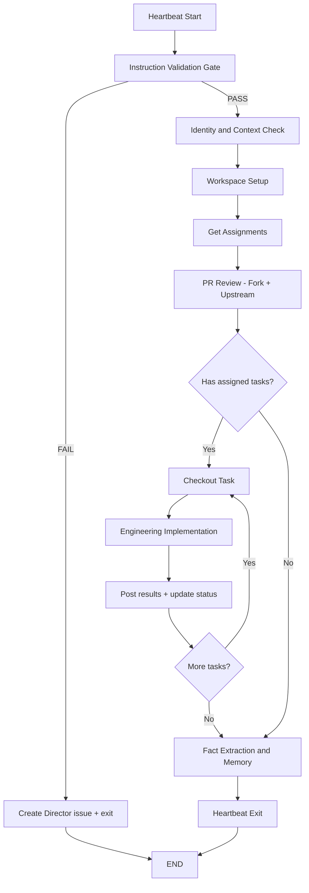

#### Checklist

- [ ] Step 1: Run **Instruction Validation Gate** workflow
  - Evidence: All four files present and > 100 bytes
- [ ] Step 2: Run **Identity and Context Check** workflow
  - Evidence: Agent id, role, budget confirmed
- [ ] Step 3: Run **Workspace Setup** workflow (if code work expected)
  - Evidence: `CLAUDE.md` read, correct branch confirmed
- [ ] Step 4: Run **Get Assignments** workflow
  - Evidence: Assignment list retrieved, prioritized
- [ ] Step 5: Run **PR Review (Fork + Upstream)** workflow
  - Evidence: All open and recently-merged PRs checked
- [ ] Step 6: For each assigned task, run **Engineering Implementation** workflow
  - Evidence: Task checked out, work completed, verification passed
- [ ] Step 7: Run **Fact Extraction and Memory** workflow
  - Evidence: Durable facts stored, timeline updated
- [ ] Step 8: Run **Heartbeat Exit** workflow
  - Evidence: All in-progress work commented, clean exit

#### Validation

- Every sub-workflow must complete or explicitly escalate before moving to the next.
- No task may be marked done without passing the verification gate (`pnpm -r typecheck && pnpm test:run && pnpm build`).

#### Blocked/Escalation

- If Instruction Validation fails: exit immediately after creating Director issue.
- If API is unreachable: retry once, then escalate to Director.
- If blocked on board-level operations: run **Board Action Request** workflow.

#### Exit Criteria

- All assigned tasks worked or explicitly blocked with comments.
- PR review complete for the cycle.
- Memory updated.
- Clean exit comment posted.

#### Loop Rules

- The task loop (Steps 6) repeats for each assigned task in priority order.
- If a task blocks, comment the blocker and move to the next task.
- PR Review runs once per heartbeat, before task work.

---

## Workflow: Instruction Validation Gate

**Objective:** Verify all four core instruction files are present and non-trivial before any other work.

**Trigger:** Start of every heartbeat (runs first, before all other steps).

**Preconditions:** None.

**Inputs:** File paths for `AGENTS.md`, `WORKFLOWS.md`, `SOUL.md`, `TOOLS.md`.

#### Mermaid Diagram

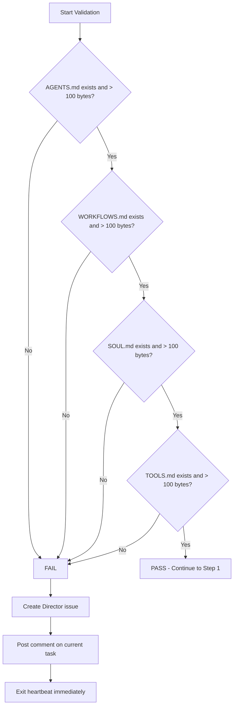

#### Checklist

- [ ] Step 1: Check `AGENTS.md` exists and exceeds 100 bytes
  - Evidence: File size in bytes
- [ ] Step 2: Check `WORKFLOWS.md` exists and exceeds 100 bytes
  - Evidence: File size in bytes
- [ ] Step 3: Check `SOUL.md` exists and exceeds 100 bytes
  - Evidence: File size in bytes
- [ ] Step 4: Check `TOOLS.md` exists and exceeds 100 bytes
  - Evidence: File size in bytes

#### Validation

| File           | Check                    |
|----------------|--------------------------|
| `AGENTS.md`    | exists and > 100 bytes   |
| `WORKFLOWS.md` | exists and > 100 bytes   |
| `SOUL.md`      | exists and > 100 bytes   |
| `TOOLS.md`     | exists and > 100 bytes   |

**PASS** -- all four files exist and exceed 100 bytes: continue to next workflow.

**FAIL** -- any file is missing, empty, or <= 100 bytes.

#### Blocked/Escalation

On FAIL:
1. Create a Director-facing issue: title `"Paperclip Engineer instruction bundle incomplete"`, link to [DSPA-421](/DSPA/issues/DSPA-421), list which files failed.
2. Post a comment on your current task (if any) noting the bundle failure.
3. **Exit the heartbeat immediately.** Do not proceed to any work.

#### Exit Criteria

- All four files validated OR Director issue created and heartbeat exited.

---

## Workflow: Master Heartbeat Orchestrator

**Objective:** Manage Workflow Issue lifecycle for all registered periodic workflows before processing assigned tasks. Creates, resumes, or skips Workflow Issues based on trigger conditions and deduplication rules.
**Trigger:** Every heartbeat, after Instruction Validation Gate passes, before Workspace Setup.
**Preconditions:** Instruction Validation Gate passed. Workflow label exists (id: `3b18b6d1-385b-48c2-8660-68b66433e9ec`).
**Inputs:** Workflow Registry Table, Paperclip API access, company ID.

### Mermaid Diagram

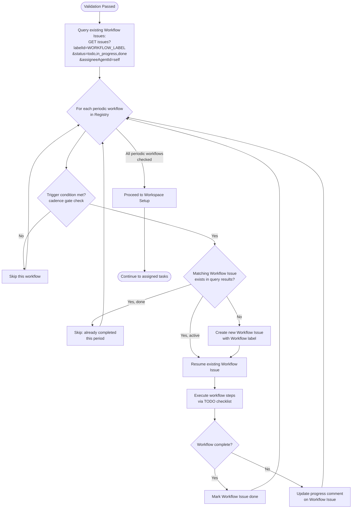

### Checklist

- [ ] Step 1: Query existing Workflow Issues — `GET /api/companies/{companyId}/issues?labelId=3b18b6d1-385b-48c2-8660-68b66433e9ec&status=todo,in_progress,done&assigneeAgentId={self}` — Evidence: issue list returned
- [ ] Step 2 (LOOP — each periodic workflow in Registry):
  - Check trigger condition (cadence gate: compare current date against last execution)
  - IF not triggered: skip, log "skipped: cadence not met"
  - IF triggered AND matching Workflow Issue exists (match by workflow name in title + current period): resume it
  - IF triggered AND no matching issue: create new Workflow Issue via `POST /api/companies/{companyId}/issues` with:
    - Title: `{Workflow Name} - {Period}` (e.g., "PR Review - 2026-04-02")
    - Labels: Workflow (`3b18b6d1-385b-48c2-8660-68b66433e9ec`) + Scheduled (`b87aa6aa-482e-4856-acde-40ed817d4360`) for periodic workflows without a parent
    - Description: **FULL workflow content from WORKFLOWS.md — mechanically copied, not regenerated.**
      Copy procedure:
      (a) Use the Read tool to load your own WORKFLOWS.md file.
      (b) Locate the target workflow section by its heading (pattern: `## Workflow: {Name}` or `### Workflow: {Name}`).
      (c) Extract from that heading through to the next horizontal rule (`---` or `***`) or the next workflow heading at the same or higher level — whichever comes first.
      (d) Use that exact extracted text as the issue description. Do NOT regenerate or summarize from memory.
      (e) **Post-creation validation:** After creating the Workflow Issue, re-read its description via `GET /api/issues/{id}` and verify these 9 section headers are ALL present: Objective, Trigger, Preconditions, Inputs, Mermaid Diagram, Checklist, Validation, Blocked/Escalation, Exit Criteria. If any are missing, immediately PATCH the description with the complete text from step (c).
    - Assignee: self
    - Goal: inherit from parent task if applicable
  - Execute workflow steps within the Workflow Issue context
  - IF matching issue exists with status `done` for current period: skip (already completed)
  - On completion: `PATCH /api/issues/{id}` with status `done` (do NOT set `hiddenAt` — hidden issues are invisible to API queries and break dedup)
  - Periodic workflows for this agent:
    - **PR Review (#5):** daily cadence — period = `YYYY-MM-DD`
  - Evidence: per-workflow action (created/resumed/skipped)
- [ ] Step 3: Proceed to Workspace Setup — Evidence: handoff complete

### Validation
- Workflow Issues created with correct label, title format, and assignee
- No duplicate Workflow Issues for same workflow + period
- Completed Workflow Issues remain visible (status=done, NO hiddenAt) for audit trail and dedup

### Blocked / Escalation
- If Workflow label missing or deleted: recreate it via `POST /api/companies/{companyId}/labels`, then continue
- If API issues prevent Workflow Issue creation: log error, proceed to Workspace Setup (do not block assigned work)

### Exit Criteria
- All periodic workflows checked — Workflow Issues created, resumed, or skipped as appropriate
- Handoff to Workspace Setup complete

---

## Workflow: Workspace Setup

**Objective:** Prepare the development environment for code work in the current heartbeat.

**Trigger:** Every heartbeat where code work is expected.

**Preconditions:** Instruction Validation Gate passed.

**Inputs:** Workspace path, expected branch (`local/dev` for day-to-day).

#### Mermaid Diagram

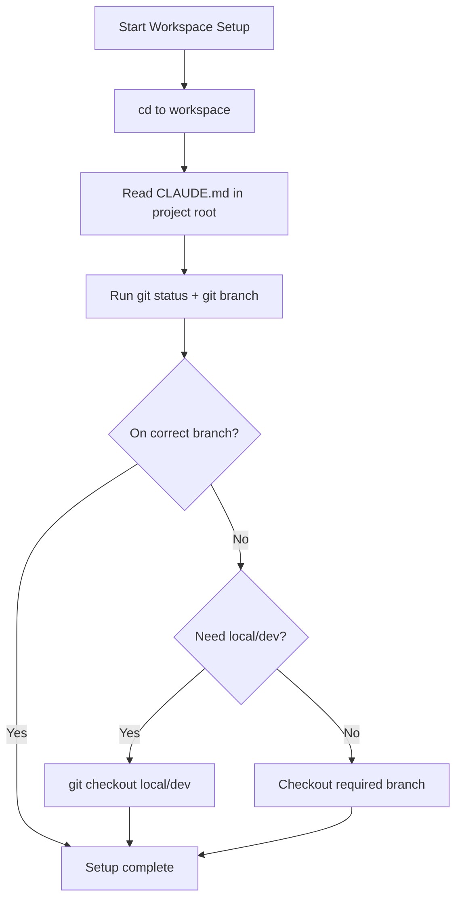

#### Checklist

- [ ] Step 1: `cd` to workspace: `C:/Users/adria/OneDrive/Documents/Claude Code Assisted/paperclip`
  - Evidence: Working directory confirmed
- [ ] Step 2: Read `CLAUDE.md` in the project root
  - Evidence: File contents reviewed, codebase source of truth loaded
- [ ] Step 3: Check current branch: `git status` and `git branch`
  - Evidence: Current branch name noted
- [ ] Step 4: If on wrong branch, switch to `local/dev` for day-to-day work
  - Evidence: Branch switch confirmed or already on correct branch

#### Validation

- Working directory is the Paperclip workspace.
- `CLAUDE.md` has been read in the current session.
- Git branch matches the expected working branch.

#### Blocked/Escalation

- If workspace directory does not exist: escalate to Director.
- If `CLAUDE.md` is missing: note in task comment, proceed with caution using cached knowledge.
- If git state is dirty with unexpected changes: report to Director before proceeding.

#### Exit Criteria

- Workspace is ready for code work with correct branch checked out and `CLAUDE.md` loaded.

---

## Workflow: Identity and Context Check

**Objective:** Confirm agent identity, role, budget, and wake context.

**Trigger:** After Instruction Validation passes, before any work.

**Preconditions:** Instruction Validation Gate passed.

**Inputs:** API endpoint, wake context environment variables.

#### Mermaid Diagram

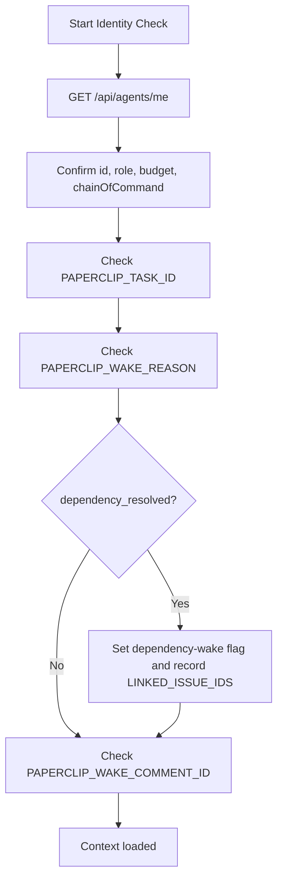

#### Checklist

- [ ] Step 1: `GET /api/agents/me` -- confirm id, role, budget, chainOfCommand
  - Evidence: API response with agent details
- [ ] Step 2: Check wake context: `PAPERCLIP_TASK_ID`
  - Evidence: Task ID value or empty
- [ ] Step 3: Check wake context: `PAPERCLIP_WAKE_REASON`
  - IF `dependency_resolved`: set dependency-wake flag, record `PAPERCLIP_LINKED_ISSUE_IDS`
  - Evidence: Wake reason value, dependency-wake flag state
- [ ] Step 4: Check wake context: `PAPERCLIP_WAKE_COMMENT_ID`
  - Evidence: Comment ID value or empty

#### Validation

- Agent identity confirmed via API.
- Wake context variables read and understood.

#### Blocked/Escalation

- If `/api/agents/me` returns error: retry once, then escalate to Director.

#### Exit Criteria

- Agent identity and wake context fully loaded.

---

## Workflow: Get Assignments

**Objective:** Retrieve and prioritize the current task queue.

**Trigger:** After Identity and Context Check, before PR Review and task work.

**Preconditions:** Identity confirmed.

**Inputs:** API endpoint, optional `PAPERCLIP_TASK_ID` from wake context.

#### Mermaid Diagram

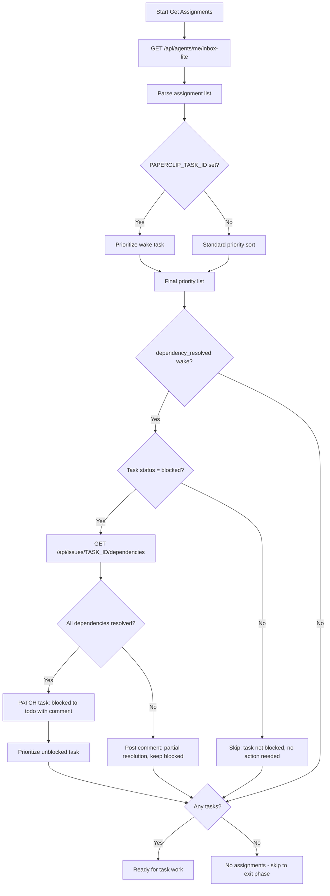

#### Checklist

- [ ] Step 1: `GET /api/agents/me/inbox-lite` for assignment list
  - Evidence: List of assignments received
- [ ] Step 2: Prioritize: `in_progress` first, then `todo`; skip `blocked` unless you can unblock it
  - Evidence: Ordered task list
- [ ] Step 3: If `PAPERCLIP_TASK_ID` is set and assigned to you, prioritize that task
  - Evidence: Wake task at top of queue if applicable
- [ ] Step 4: Board-assignment guard — For each issue in inbox, check if `assigneeUserId` is set (board-assigned). Board-assigned issues are always blocked per company rules.
  - IF `assigneeUserId` is set AND `assigneeAgentId` is null: issue is board-assigned — skip it (treat as blocked)
  - IF status is not already `blocked`: flag in exit comment as anomaly
  - IF `assigneeUserId` is set AND `assigneeAgentId` is also set: normal agent assignment, process normally
  - Evidence: Board-assigned issues identified and skipped
- [ ] Step 5: Dependency re-evaluation (IF `PAPERCLIP_WAKE_REASON=dependency_resolved`)
  - IF task status is NOT `blocked`: skip (task already unblocked by different path)
  - Fetch `PAPERCLIP_TASK_ID` task dependencies: `GET /api/issues/{taskId}/dependencies`
  - Check each dependency's status (resolved = blocker issue status is `done` or `cancelled`)
  - IF all dependencies resolved:
    - `PATCH /api/issues/{taskId}` with `{"status": "todo", "comment": "All blocker dependencies resolved. Unblocking task.\n\nResolved: [list of resolved issue links]"}`
    - Include `X-Paperclip-Run-Id` header
    - Prioritize this task for work this heartbeat
  - IF some dependencies remain unresolved:
    - `POST /api/issues/{taskId}/comments` with acknowledgment of partial resolution
    - Keep task `blocked`; do NOT prioritize for work
  - Evidence: Dependencies checked, task transitioned or comment posted

#### Validation

- Assignment list retrieved and parsed.
- Priority order determined.
- If `dependency_resolved` wake: dependency re-evaluation completed with correct status transition.

#### Blocked/Escalation

- If inbox API fails: retry once, then proceed with wake task only (if set).
- If dependency API fails: log error, treat task as still blocked, continue with other work.

#### Exit Criteria

- Prioritized task list ready, or confirmed no assignments.
- If `dependency_resolved` wake: blocked task transitioned to `todo` (all deps resolved) or kept `blocked` with partial-resolution comment.

---

## Workflow: PR Review (Fork + Upstream)

**Objective:** Check all open pull requests on every heartbeat, handle feedback, monitor recently-merged PRs for follow-up directives.

**Trigger:** Every heartbeat, regardless of assigned tasks. Runs before task work.

**Preconditions:** Identity confirmed, workspace setup complete.

**Inputs:** Fork repo (`smaugho/paperclip`), upstream repo (`paperclipai/paperclip`).

#### Mermaid Diagram

```mermaid
graph TD
    A[Start PR Review] --> B[List open fork PRs]
    B --> C[List recently merged fork PRs - last 10]
    C --> D{Any open fork PRs?}
    D -->|Yes| E[For each: check comments/reviews]
    D -->|No| F{Any recently merged PRs?}
    E --> E1[Address feedback: push fixes, respond]
    E1 --> E2{PR approved + ready to merge?}
    E2 -->|Yes| E3[Note in task comment for board]
    E2 -->|No| E4[Continue to next PR]
    E3 --> E4
    E4 --> F
    F -->|Yes| G[For each merged PR closed < 24h ago]
    F -->|No| H[Check for upstream PR directives]
    G --> G1[Check PR comments for follow-up]
    G1 --> H
    H --> H1[Check BOTH fork PR comments AND Paperclip task]
    H1 --> H2{Board directive to create upstream PR?}
    H2 -->|Yes| I[Run Upstream PR Gate workflow]
    H2 -->|No| J[Move to upstream PR review]
    I --> J
    J --> K[List open upstream PRs authored by smaugho]
    K --> L{Any open upstream PRs?}
    L -->|Yes| M[For each: read feedback]
    L -->|No| N[PR Review complete]
    M --> M1[Draft suggested response in task comment]
    M1 --> M2{Code changes needed?}
    M2 -->|Yes| M3[Implement on fork branch + push]
    M2 -->|No| N
    M3 --> N
```

#### Checklist

**Fork PRs (`smaugho/paperclip`) -- full ownership:**

- [ ] Step 1: List all open PRs: `gh pr list --repo smaugho/paperclip --state open`
  - Evidence: PR list output
- [ ] Step 2: List recently merged PRs (last 10): `gh pr list --repo smaugho/paperclip --state merged --limit 10`
  - Evidence: Merged PR list output
- [ ] Step 3: For each **open** PR, scan the full PR conversation surface: top-level PR comments, review summaries, and inline review comments/threads. Use `gh pr view <number> --repo smaugho/paperclip --comments` plus any additional GitHub query needed to confirm no open review-thread concerns are being missed.
  - Evidence: Full conversation surface reviewed for each open PR; unresolved/open thread status noted
- [ ] Step 4: For each **merged PR closed within the last 24 hours**, scan that same full PR conversation surface for new follow-up comments or still-open review-thread concerns.
  - Evidence: Post-merge full conversation surface checked
- [ ] Step 5: Address feedback directly: push fixes, respond to review comments, resolve conversations, and do not treat a PR as handled while unresolved/open PR comment or review-thread concerns remain
  - Evidence: Fix commits pushed, responses posted
- [ ] Step 5b: **Open-comment verification gate (BLOCKING).** Before treating any PR as handled, enumerate ALL unresolved/open comments and review threads using `gh api repos/{owner}/{repo}/pulls/{number}/comments` and `gh pr view {number} --repo {owner}/{repo} --comments`. List each unresolved item explicitly. Confirm each has been addressed (fix pushed, reply posted, or intentionally deferred with written justification). Do NOT proceed to Step 6 while any comment or thread remains unaddressed without justification.
  - Evidence: Per-PR list of all open comments/threads with disposition (addressed / deferred with reason)
- [ ] Step 6: If a PR is approved and ready to merge, note it in task comment for board awareness
  - Evidence: Task comment posted
- [ ] Step 7: For merged PRs, check **both** the fork PR comments **and** the corresponding Paperclip task for a board directive to create an upstream PR
  - Evidence: Both locations checked; directive found or not found

**CRITICAL RULE:** Only create an upstream PR if the board explicitly asked for it in either location. Do NOT automatically create upstream PRs for merged fork PRs.

**Upstream PRs (`paperclipai/paperclip`) -- read-only, suggest responses:**

- [ ] Step 8: List open PRs you authored: `gh pr list --repo paperclipai/paperclip --state open --author smaugho`
  - Evidence: Upstream PR list output
- [ ] Step 9: For each PR with new comments/reviews, read the feedback carefully
  - Evidence: Feedback contents noted
- [ ] Step 10: **Do NOT respond directly on upstream.** Draft a suggested response in your Paperclip task comment
  - Evidence: Suggested response posted with tag `**Suggested upstream PR response for board review:**`
- [ ] Step 11: Include the PR URL, the reviewer comment you are responding to, and your proposed reply
  - Evidence: Complete context in task comment
- [ ] Step 12: If code changes are needed based on feedback, implement them on your fork branch and push
  - Evidence: Fix commits pushed (upstream PR updates automatically if it tracks the fork branch)

#### Validation

- All open fork PRs have been checked for comments.
- All recently-merged fork PRs (< 24h) have been checked for follow-up directives.
- All open upstream PRs have been checked for feedback.
- Any actions taken are documented in task comments.

#### Blocked/Escalation

- If `gh` CLI fails: report error, retry once, then note in task comment and continue.
- If upstream reviewers request changes you cannot make: draft response in task comment and escalate to Director.

#### Exit Criteria

- If no open PRs exist on either repo, skip this step.
- Always post a brief summary in your task comment if you took any PR action (e.g., "Addressed review on smaugho/paperclip#42, pushed fix commit").
- All PRs reviewed, all feedback addressed or escalated.

#### Loop Rules

- Iterate through each open PR and each recently-merged PR individually.
- Do not skip any PR -- check every one.
- Post-merge monitoring continues for 24 hours after merge/close.

---

## Workflow: Upstream PR Gate

**Objective:** Enforce the strict sequential gate before creating any upstream PR. This is the most critical process control in the Paperclip Engineer role.

**Trigger:** Board directive found (explicit comment saying "create upstream PR" or similar).

**Preconditions:**
1. Fork PR exists and has been merged.
2. Explicit board directive found in fork PR comments OR Paperclip task comments.

**Inputs:** Fork PR number, board directive text, upstream repo (`paperclipai/paperclip`).

#### Mermaid Diagram

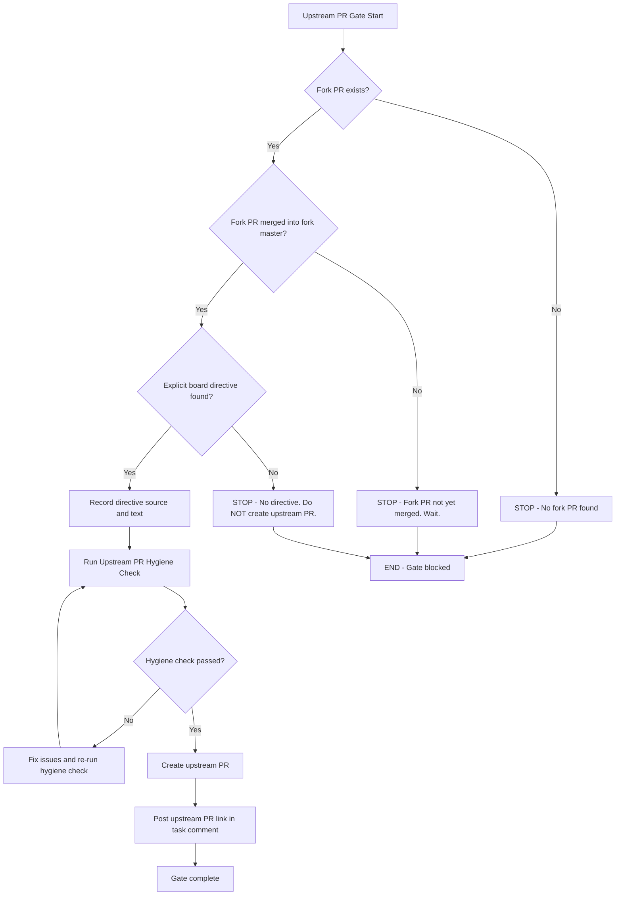

#### Checklist

- [ ] Step 1: Confirm fork PR exists
  - Evidence: Fork PR number and URL
- [ ] Step 2: Confirm fork PR has been merged into fork `master` by Adrian
  - Evidence: PR state = merged
- [ ] Step 3: Confirm explicit board directive exists
  - Evidence: Quote the directive text and its location (fork PR comment or task comment)
- [ ] Step 4: Run **Upstream PR Hygiene Check** workflow
  - Evidence: All hygiene checks passed
- [ ] Step 5: Create PR on `paperclipai/paperclip`
  - Evidence: `gh pr create --repo paperclipai/paperclip --base master --head smaugho:<branch>`
- [ ] Step 6: Post upstream PR link in task comment immediately
  - Evidence: Comment posted with format `PR: [paperclipai/paperclip#N](URL) -- {description}`

#### Validation

**All three gates must be TRUE before Step 5:**

| Gate | Condition | Status |
|------|-----------|--------|
| Fork PR merged | PR state = merged on `smaugho/paperclip` | Must be TRUE |
| Explicit directive | Board comment found saying "create upstream PR" | Must be TRUE |
| Hygiene passed | All upstream PR hygiene checks green | Must be TRUE |

**VIOLATION:** Creating an upstream PR without all three gates being TRUE is a **critical process violation**.

#### Blocked/Escalation

- If fork PR is not yet merged: wait. Do not prompt the board.
- If no explicit directive found: do NOT create the upstream PR. If you believe one should be created, ask the board -- do not assume.
- If hygiene check fails: fix the issues before proceeding. Do not skip hygiene.

#### Exit Criteria

- Upstream PR created with link posted in task comment, OR gate blocked with clear reason documented.

---

## Workflow: Upstream PR Hygiene Check

**Objective:** Validate that an upstream PR branch contains only the intended changes, is properly scoped, and passes all verification.

**Trigger:** Before every upstream PR creation (called by Upstream PR Gate workflow).

**Preconditions:** Branch exists with changes intended for upstream submission.

**Inputs:** Branch name, upstream remote (`upstream/master`).

#### Mermaid Diagram

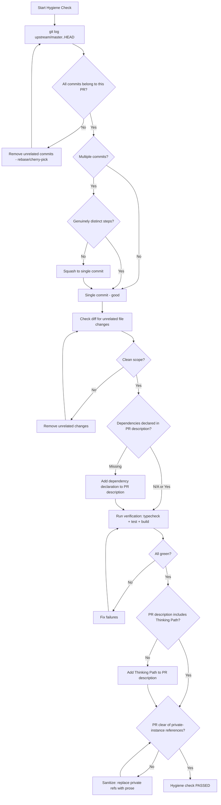

#### Checklist

- [ ] Step 1: **Scope check**: `git log upstream/master..HEAD` -- every commit belongs to this PR's logical change only
  - Evidence: Commit log output showing only relevant commits
- [ ] Step 2: **Single commit preferred**: if multiple commits are present, squash unless they are genuinely distinct steps (e.g., migration + logic)
  - Evidence: Commit count and justification if > 1
- [ ] Step 3: **No unrelated fixes**: grep the diff for any changes outside the files this PR is meant to touch
  - Evidence: `git diff upstream/master..HEAD --stat` shows only expected files
- [ ] Step 4: **Dependency declared**: if the branch depends on another PR/commit, the PR description must say so explicitly
  - Evidence: PR description excerpt or "N/A -- no dependencies"
- [ ] Step 5: **Verification passed**: `pnpm -r typecheck && pnpm test:run && pnpm build` all green on the isolated branch
  - Evidence: Command output showing all pass
- [ ] Step 6: **PR description includes Thinking Path**: required by CONTRIBUTING.md
  - Evidence: Thinking Path section present in PR description
- [ ] Step 7: **Upstream PR clarity check**: PR title and body must NOT contain private-instance references
  - No `DSPA-*` or any `{PREFIX}-{NUMBER}` private Paperclip instance identifiers
  - No `/DSPA/issues/...` or private Paperclip instance URLs (e.g., `127.0.0.1:3100`)
  - No unexplained local-only configuration assumptions (e.g., private agent IDs, internal hostnames)
  - All internal context must be translated into descriptive prose or public GitHub links
  - If any private references are found: rewrite them into self-contained prose before proceeding
  - Evidence: PR title and body reviewed, no private-instance references present

#### Validation

All seven checks must pass. Any failure loops back to fix and re-check.

#### Blocked/Escalation

- If verification cannot pass on the isolated branch: investigate root cause. May need to rebase onto latest `upstream/master`.
- If scope cannot be cleanly isolated: escalate to Director for guidance.

#### Exit Criteria

- All six hygiene checks pass. Branch is ready for upstream PR creation.

#### Loop Rules

- Steps 1-3 may loop multiple times as unrelated changes are removed.
- Step 5 may loop if fixes break verification.
- Maximum 3 loops before escalating to Director.

---

## Workflow: Engineering Implementation

**Objective:** Execute a complete engineering task from understanding through verification.

**Trigger:** Assigned task requires code changes.

**Preconditions:** Workspace setup complete, task checked out.

**Inputs:** Task ID, issue description, all comments.

#### Mermaid Diagram

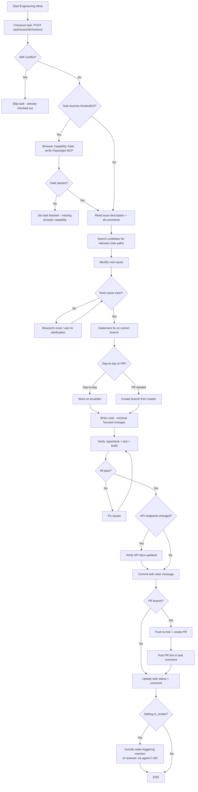

#### Checklist

**Phase 0: Browser Capability Gate (conditional)**

- [ ] Step 0: IF the task touches frontend code, UI contracts consumed by the UI, or any user-visible behavior:
  - Execute the Browser Capability Precondition (see company rules): confirm `mcp__playwright__browser_navigate` is available, open Tab 0 identity page.
  - If the gate fails: attempt `/mcp reconnect` once. If still unavailable, set task to `blocked` with a comment naming the missing capability. Do NOT proceed.
  - If the gate passes: continue to Phase A.
  - IF the task is purely backend with no UI-visible impact, skip this step.
  - Evidence: Gate pass confirmed (Tab 0 visible) or task set to blocked

**Phase A: Understand the Problem**

- [ ] Step 1: Read the issue description and all comments
  - Evidence: Issue content summarized
- [ ] Step 2: Search the codebase for relevant code paths
  - Evidence: Relevant files and functions identified
- [ ] Step 3: Identify root cause before writing any fix
  - Evidence: Root cause documented

**Phase B: Implement**

- [ ] Step 4: Determine correct branch (local/dev for day-to-day, branch from master for PRs)
  - Evidence: Branch name and rationale
- [ ] Step 5: Follow existing code patterns and conventions
  - Evidence: Code matches surrounding style
- [ ] Step 6: Keep changes minimal and focused
  - Evidence: Diff shows only necessary changes

**Phase C: Verify**

- [ ] Step 7: Run verification: `pnpm -r typecheck && pnpm test:run && pnpm build`
  - Evidence: All three commands pass
- [ ] Step 7b: IF this change adds, modifies, or removes API endpoints: verify the relevant API documentation surface (e.g., API reference docs, endpoint tables, route documentation) has been updated to reflect the change. Include the documentation update in the same PR or commit.
  - Evidence: Documentation surface named and updated, or "no API changes in this task"

**Phase D: Commit**

- [ ] Step 8: Write clear commit message explaining the "why"
  - Evidence: Commit message text
- [ ] Step 9: Add `Co-Authored-By: Paperclip <noreply@paperclip.ing>` to commit message
  - Evidence: Trailer present in commit
- [ ] Step 10: Confirm none of the forbidden files are staged (CLAUDE.md, pnpm-lock.yaml, .playwright-mcp/, communications-tracker.json)
  - Evidence: `git status` output
- [ ] Step 11: If PR branch: push to fork and create PR, then post PR link in task comment
  - Evidence: PR URL posted in task comment
- [ ] Step 12: If local/dev: merge fix branch into local/dev
  - Evidence: Merge completed
- [ ] Step 13: Update task status and post completion comment
  - Set to `in_review` (not `done`) for completed domain work. Use `done` only for housekeeping tasks.
  - IF setting `in_review` for work with a PR: the comment MUST include a wake-triggering mention of `[@DevSecFinOps Engineer](agent://ce6f0942-0925-4d84-a99f-aca6943effbe)` for code quality review. The `agent://` URI triggers the heartbeat wake. Profile links (`/DSPA/agents/...`) do NOT trigger wakes. For non-PR deliverables or escalation, identify the reviewer from `chainOfCommand`.
  - Evidence: Task status updated, comment posted with wake-triggering mention

#### Validation

- Verification gate passed (typecheck + test + build).
- If API endpoints were added/modified/removed: relevant API documentation surface updated.
- No forbidden files committed.
- PR link posted in task comment (if PR created).

#### Blocked/Escalation

- If root cause is unclear after investigation: post findings in task comment, request guidance from Director.
- If verification fails and cannot be fixed: post the error in task comment, mark task as blocked.
- If blocked on board-level operations: run **Board Action Request** workflow.
- Never retry a 409 on checkout -- skip the task.

#### Exit Criteria

- Code change verified, committed, and (if applicable) PR created with link posted.
- Task status set to `in_review` with review-ready evidence in the comment (per dspot-company-rules Task Completion and Review Handoff). Use `done` only for housekeeping tasks.
- When setting `in_review` for PR work: comment includes wake-triggering mention of `[@DevSecFinOps Engineer](agent://ce6f0942-0925-4d84-a99f-aca6943effbe)` for code quality review (not a profile link). For non-PR deliverables, identify the reviewer from `chainOfCommand`.

#### Loop Rules

- Verification loop (Steps 7 -> fix -> 7) runs until all pass or escalation.
- Maximum 5 verification loops before escalating.

---

## Workflow: Fork Contribution (End-to-End)

**Objective:** Execute the complete fork-based contribution process from sync through PR creation.

**Trigger:** A code change needs to be contributed via the fork workflow.

**Preconditions:** Workspace setup complete, change identified.

**Inputs:** Fix/feature description, relevant files.

#### Mermaid Diagram

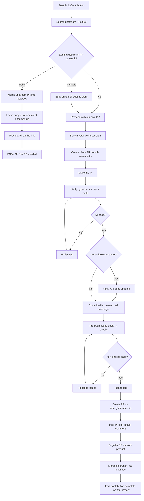

#### Checklist

- [ ] Step 1: Search upstream PRs: `gh pr list --repo paperclipai/paperclip --state open --search "<keywords>"`
  - Evidence: Search results
- [ ] Step 2: Sync master: `git checkout master && git fetch upstream && git merge upstream/master && git push origin master`
  - Evidence: Master synced with upstream
- [ ] Step 3: Create PR branch: `git checkout -b fix/short-description master`
  - Evidence: Branch created from master
- [ ] Step 4: Make the fix following project conventions
  - Evidence: Changes made
- [ ] Step 5: Verify: `pnpm -r typecheck && pnpm test:run && pnpm build`
  - Evidence: All pass
- [ ] Step 5b: IF this change adds, modifies, or removes API endpoints: verify the relevant API documentation surface has been updated to reflect the change.
  - Evidence: Documentation surface updated, or "no API changes"
- [ ] Step 6: Commit: `git add <specific-files>` then conventional commit message
  - Evidence: Commit created (never `git add -A`)
- [ ] Step 6.5: **Pre-push scope audit** (MANDATORY before pushing)
  - [ ] 6.5a: **Branch base check:** Verify the current branch descends from `origin/master`.
    Run `git merge-base --is-ancestor origin/master HEAD` — must exit 0.
    If it fails: rebase onto `origin/master` before continuing.
    - Evidence: Command exits 0
  - [ ] 6.5b: **Scope check:** Review the diff between `origin/master` and HEAD.
    ALL changed files must be relevant to this contribution. No stale commits from other branches, no unrelated changes.
    - Evidence: `git diff origin/master..HEAD --stat` output reviewed, all files justified
  - [ ] 6.5c: **Commit count:** Prefer a single commit. Multiple commits are acceptable only when they represent genuinely distinct logical steps (e.g., migration + business logic).
    - Evidence: `git log origin/master..HEAD --oneline` output reviewed
  - [ ] 6.5d: **Forbidden files check:** Verify NONE of the project's forbidden files (per TOOLS.md section 5.5) appear in the diff. For Paperclip: `CLAUDE.md`, `pnpm-lock.yaml`, `.playwright-mcp/*`, `communications-tracker.json`.
    - Evidence: `git diff origin/master..HEAD --name-only` output reviewed, no forbidden files present
- [ ] Step 7: Push: `git push -u origin fix/short-description`
  - Evidence: Branch pushed to fork
- [ ] Step 8: Create PR: `gh pr create --repo smaugho/paperclip --base master --head fix/short-description`
  - Evidence: PR created with Thinking Path + Upstream Search Evidence
- [ ] Step 9: Post PR link in task comment immediately
  - Evidence: Task comment posted
- [ ] Step 9b: **Register PR as work product (MANDATORY).** After posting the PR link comment, register the PR in Paperclip so it appears in the Work Products section and triggers auto-labeling:
  ```bash
  curl -s -X POST \
    -H "Authorization: Bearer $PAPERCLIP_API_KEY" \
    -H "Content-Type: application/json" \
    -H "X-Paperclip-Run-Id: $PAPERCLIP_RUN_ID" \
    "$PAPERCLIP_API_URL/api/issues/{issueId}/work-products" \
    -d '{"type":"pull_request","url":"https://github.com/smaugho/paperclip/pull/{number}","title":"{PR title}"}'
  ```
  This enables `has-pr` auto-labeling and PR state tracking via reconciliation.
  - Evidence: Work product created (API returns ID)
- [ ] Step 10: Merge into local/dev: `git checkout local/dev && git merge fix/short-description`
  - Evidence: local/dev updated

#### Validation

- PR description includes Thinking Path and Upstream Search Evidence.
- Verification passed before committing.
- If API endpoints were added/modified/removed: relevant API documentation surface updated in the PR.
- PR link posted in task comment.

#### Blocked/Escalation

- If upstream PR fully covers the fix: do not create a fork PR; merge upstream work into local/dev instead.
- If verification fails: fix before pushing.

#### Exit Criteria

- Fork PR created, link posted, local/dev updated.
- Task status set to `in_review` with PR link and verification evidence (per dspot-company-rules Task Completion and Review Handoff).

#### Paperclip Fork PR Requirements

These apply ONLY when contributing to the Paperclip repository via this workflow:

- **Thinking Path required:** Every PR description must include a Thinking Path section per CONTRIBUTING.md.
- **Upstream Search Evidence required:** Every fork PR must include proof that upstream was searched for existing PRs covering the same change.
- **Paperclip forbidden files:** `CLAUDE.md`, `pnpm-lock.yaml`, `.playwright-mcp/*`, `communications-tracker.json` must never appear in the diff (per TOOLS.md section 5.5).
- **Paperclip verification gate:** `pnpm -r typecheck && pnpm test:run && pnpm build` must all pass.

#### Upstream Promotion Requirements (Workflow #7 context)

- **Privacy sanitization:** When promoting a fork PR to upstream, all private-instance references (DSPA-*, 127.0.0.1, internal URLs, private agent IDs) must be removed or rewritten as descriptive prose. This is already enforced by Workflow #7, Step 7.

---

## Workflow: Fact Extraction and Memory

**Objective:** Persist durable facts and timeline entries from the current heartbeat.

**Trigger:** After all task work is complete, before heartbeat exit.

**Preconditions:** Work has been done that produced learnings or outcomes.

**Inputs:** Work completed during the heartbeat, decisions made, outcomes observed.

#### Mermaid Diagram

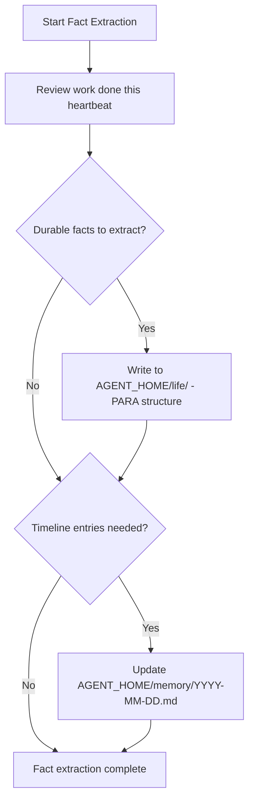

#### Checklist

- [ ] Step 1: Review all work done during this heartbeat
  - Evidence: Summary of tasks worked, PRs created/reviewed, issues resolved
- [ ] Step 2: Extract durable facts to `$AGENT_HOME/life/` (PARA structure)
  - Evidence: Facts written to appropriate files
- [ ] Step 3: Update `$AGENT_HOME/memory/YYYY-MM-DD.md` with timeline entries
  - Evidence: Timeline entries appended

#### Validation

- Facts are durable (not ephemeral status updates).
- Timeline entries are concise and dated.

#### Blocked/Escalation

- If memory paths are inaccessible: note in exit comment, proceed.

#### Exit Criteria

- All durable facts stored and timeline updated.

---

## Workflow: Board Action Request

**Objective:** Request board-level action (plugin installs, secrets, approvals) with minimal board time waste.

**Trigger:** Blocked on an operation requiring board-level auth.

**Preconditions:** Operation confirmed to require board auth (not something you can do yourself).

**Inputs:** Exact operation needed, copy-paste commands if applicable.

#### Mermaid Diagram

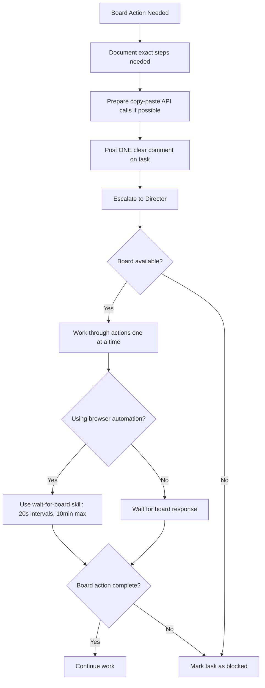

#### Checklist

- [ ] Step 1: Clearly document the exact steps the board needs to take
  - Evidence: Step-by-step instructions written
- [ ] Step 2: Provide copy-paste API calls when possible
  - Evidence: Runnable commands included
- [ ] Step 3: Post ONE clear comment on the task explaining what you need
  - Evidence: Comment posted (single, clear request)
- [ ] Step 4: If board is available and needs sequential actions, work through them one at a time
  - Evidence: No topic switching while board is acting
- [ ] Step 5: If using browser automation, use `wait-for-board` skill (20-second intervals, up to 10 minutes)
  - Evidence: Polling used instead of moving to other work
- [ ] Step 6: Never navigate away from a page the board is actively interacting with
  - Evidence: Page maintained during board interaction

#### Validation

- Request is clear and actionable.
- Board time minimized.

#### Blocked/Escalation

- If board does not respond within polling window: mark task as blocked with clear description.
- Post blocker on the issue and escalate to Director.

#### Exit Criteria

- Board action completed and work can continue, OR task marked as blocked with clear documentation.

---

## Workflow: Heartbeat Exit

**Objective:** Cleanly terminate the heartbeat cycle with all work documented.

**Trigger:** All task work complete, or no assignments, or heartbeat must end.

**Preconditions:** All preceding workflows have completed or been skipped with documentation.

**Inputs:** Work done during the heartbeat, task states.

#### Mermaid Diagram

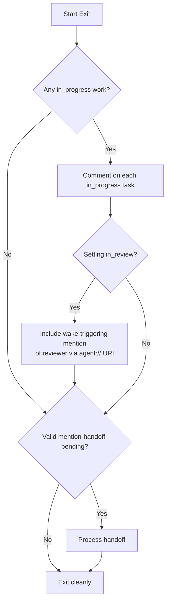

#### Checklist

- [ ] Step 1: Comment on any in_progress work before exiting
  - IF setting `in_review` for work with a PR: the comment MUST include a wake-triggering mention of `[@DevSecFinOps Engineer](agent://ce6f0942-0925-4d84-a99f-aca6943effbe)` for code quality review. The `agent://` URI triggers the heartbeat wake. Profile links (`/DSPA/agents/...`) do NOT trigger wakes. For non-PR deliverables or escalation, identify the reviewer from `chainOfCommand`.
  - Evidence: All in_progress tasks have current status comments (with wake-triggering mentions where applicable)
- [ ] Step 2: If no assignments and no valid mention-handoff, exit cleanly
  - Evidence: Clean exit or handoff processed
- [ ] Step 3: **Full task accounting** — The final exit comment MUST list EVERY assigned task from the inbox with its disposition:
  - **Progressed:** what was done this heartbeat and what remains
  - **Deferred:** explicitly state why (time constraint, deprioritized, dependency not met)
  - **Blocked:** blocker details and who needs to act
  - **Not started:** state reason (new assignment not yet reached, lower priority)
  - Evidence: Exit summary posted covering all assigned tasks
- [ ] Step 4: **Dependency-aware status check** — For each task in `todo`, verify it is actually workable. If it has an unmet dependency, transition it to `blocked` with explicit blocker details.
  - Evidence: No task left in `todo` with unmet dependencies
- [ ] Step 5: **Stale `in_review` escalation** — During inbox scanning, if any task you own has been in `in_review` for more than 12 hours with no manager acknowledgment (no comment or status change), post a follow-up comment tagging the Director. Do NOT change the status — leave it as `in_review`. If no response after a second 12-hour window, escalate per the Escalation Protocol (Severity 2).
  - Evidence: Stale in_review items flagged or "none stale"

**Honest language rule:** Never use "all tasks addressed", "complete", or "done" in exit summaries unless tasks are literally finished (status=done) or explicitly blocked. Use precise language: "progressed", "deferred", "not started this heartbeat".

#### Validation

- No in_progress task left without a current comment.
- Exit summary accounts for every assigned task in inbox (none silently omitted).

#### Blocked/Escalation

- None. Exit always succeeds.

#### Exit Criteria

- All work documented. Exit summary includes disposition for every assigned task (no omissions). No task left in `todo` status when it has unmet dependencies. When setting `in_review` for PR work: comment includes wake-triggering mention of `[@DevSecFinOps Engineer](agent://ce6f0942-0925-4d84-a99f-aca6943effbe)` for code review. For non-PR deliverables, mention reviewer from `chainOfCommand`. Clean exit.

---

## Workflow: Browser Platform Verification

**Objective:** Establish browser identity and verify platform access using Playwright MCP tools before performing any browser-based task work.

**Trigger:** A task requires browser interaction (onboarding verification, platform testing, UI validation, or any work involving web-based tools).

**Preconditions:** Playwright MCP tools are available (`mcp__playwright__*`). Task context is loaded.

**Inputs:** Current task identifier, title, description. Agent identity from Step 3.

#### Mermaid Diagram

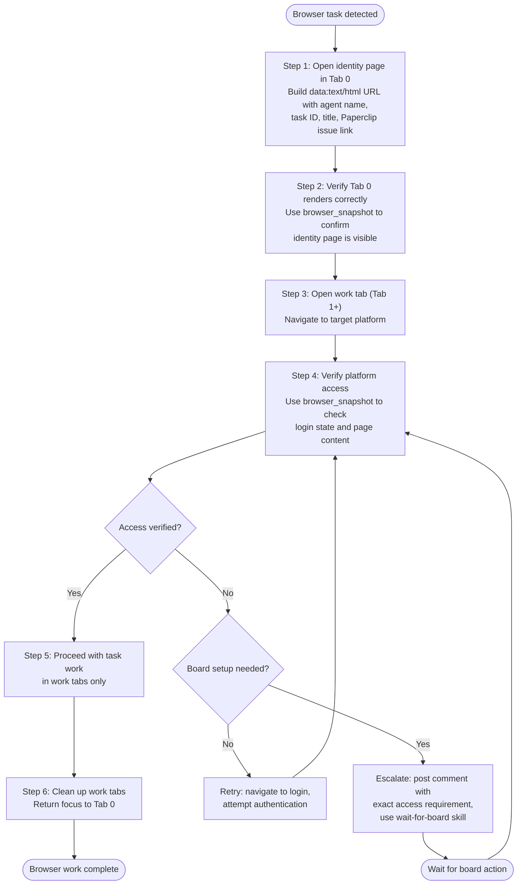

#### Checklist

- [ ] Step 1: Build and navigate to identity page in Tab 0 — use `data:text/html` URL with agent name, role, task ID, title, description (first 300 chars), and clickable Paperclip issue link. Use `mcp__playwright__browser_navigate` — Evidence: Tab 0 shows identity page
- [ ] Step 2: Verify identity page via `mcp__playwright__browser_snapshot` — confirm agent name, task ID, and issue link are visible — Evidence: snapshot confirms identity content
- [ ] Step 3: Open new tab for task work — navigate to target platform URL — Evidence: work tab opened
- [ ] Step 4: Verify platform access — use `mcp__playwright__browser_snapshot` to check login state and page content — Evidence: snapshot confirms access
  - IF access denied: check if board setup is needed → escalate with exact requirement and use `wait-for-board` skill
  - IF login required: attempt authentication, re-verify
- [ ] Step 5: Perform browser-based task work in work tabs (Tab 1+) — never navigate Tab 0 away from identity page — Evidence: task work completed
- [ ] Step 6: Close work tabs, return focus to Tab 0 — Evidence: only identity tab remains

#### Validation

- Tab 0 identity page is open and matches current task throughout the session
- All browser work uses Playwright MCP tools (`mcp__playwright__*`) exclusively — no Chrome MCP references
- Prefer `browser_snapshot` over `browser_take_screenshot` (snapshots are machine-readable and faster)
- Screenshots saved to `.playwright-mcp/` with naming convention `{platform}-{description}-{date}.png`

#### Blocked / Escalation

- If platform access requires board setup (credentials, MFA, OAuth): post a comment with the exact access requirement on the current task and use the `wait-for-board` skill to poll until resolved
- If Playwright MCP tools are unavailable: post blocked comment on task, escalate per Escalation Protocol

#### Exit Criteria

- Identity page confirmed in Tab 0 with correct task context
- Platform access verified via snapshot
- All browser work completed using Playwright MCP tools only
- Work tabs cleaned up, focus returned to Tab 0

---

## Appendix A: Paperclip Engineer Responsibilities Summary

- **Platform stability**: Fix bugs that affect agent execution (API key injection, stale locks, checkout flow).
- **Feature development**: Build new platform capabilities as requested.
- **Plugin system**: Develop and maintain plugins (Telegram, etc.).
- **Build health**: Keep typecheck, tests, and build green.
- **Infrastructure**: Docker, database migrations, deployment.
- **Escalation**: When blocked on board-level operations (plugin installs, secrets), document exact steps needed and escalate to Director.

---

## Appendix B: Standing Rules (Referenced by All Workflows)

These rules apply across all workflows and are enforced at every step:

1. Always use the Paperclip skill for coordination.
2. Always include `X-Paperclip-Run-Id` header on mutating API calls.
3. Comment in concise markdown.
4. Never look for unassigned work -- only work on what is assigned to you.
5. Read CLAUDE.md before every code session.
6. Verify (typecheck + test + build) before marking anything done.
7. Never commit: `CLAUDE.md`, `pnpm-lock.yaml`, `.playwright-mcp/`, `communications-tracker.json`.
8. Always post PR links in task comments immediately after creating a PR.
9. Company-scope all domain entities.
10. Revert when wrong -- if a fix is identified as incorrect or unnecessary, revert promptly.
