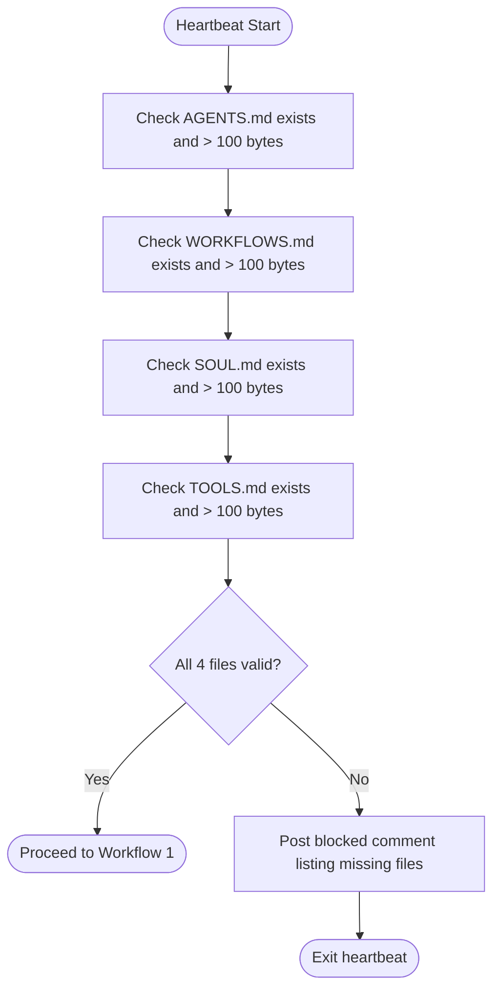
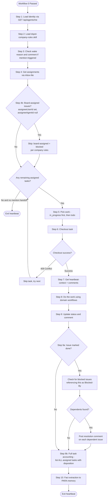
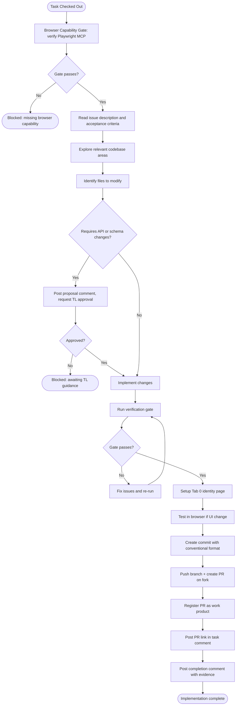
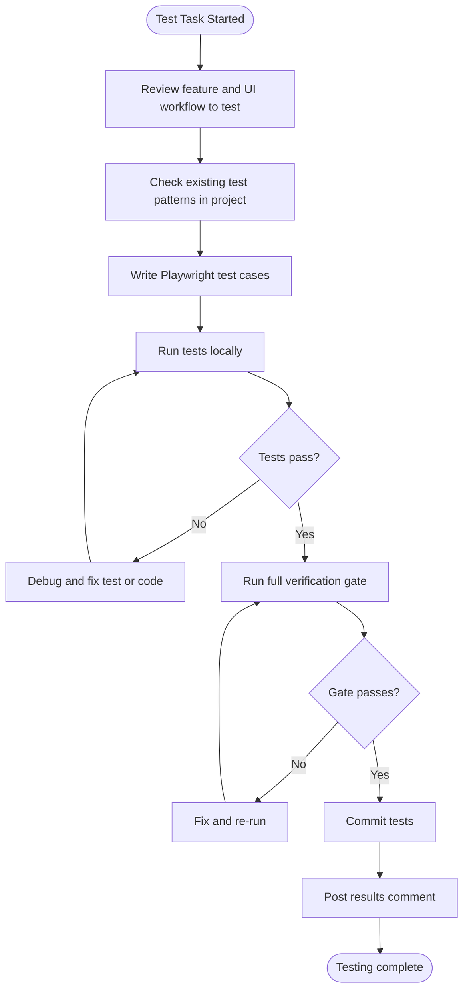
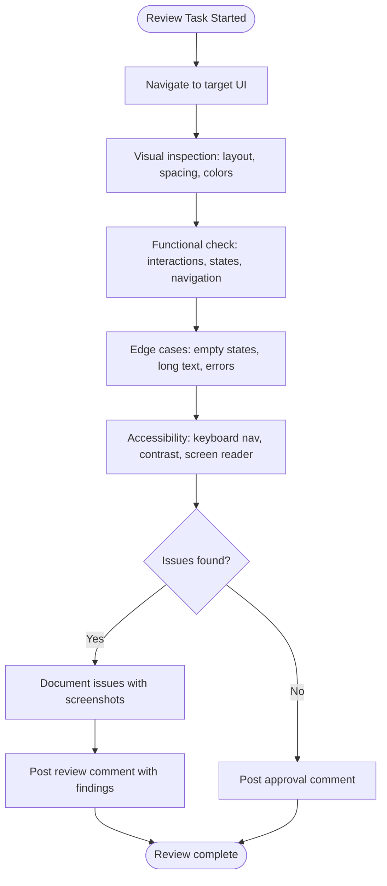
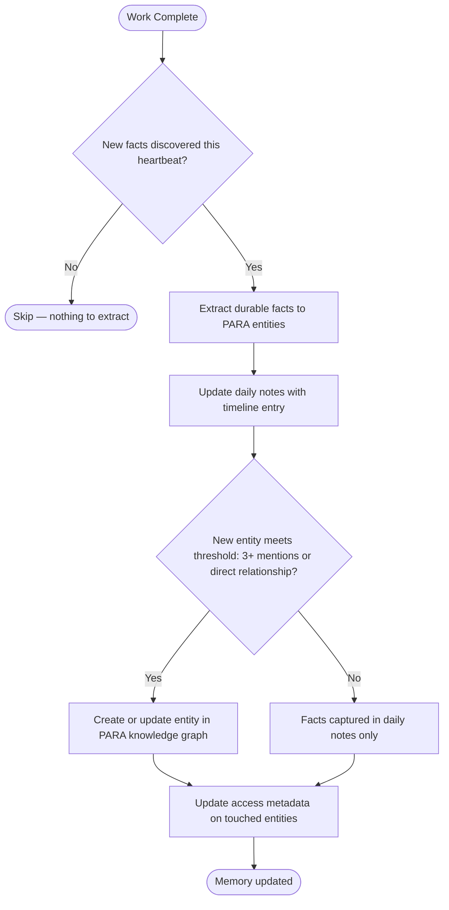
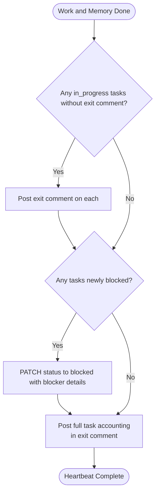

# Paperclip Frontend Engineer — Workflow Procedures

## Workflow Registry

| # | Workflow | Type | Trigger |
|---|---------|------|---------|
| 0 | Instruction Validation Gate | always | Every heartbeat, first action |
| 1 | Standard Heartbeat Procedure | always | Every heartbeat, after Step 0 |
| 2 | Frontend Implementation | task-triggered | Assigned feature/fix task |
| 3 | Playwright E2E Testing | task-triggered | Assigned test task or post-implementation |
| 4 | UI Review and Validation | task-triggered | Assigned review task |
| 5 | Fact Extraction and Memory Update | always | Every heartbeat, before exit |
| 6 | Heartbeat Exit | always | Every heartbeat, last action |

---

## Workflow 0: Instruction Validation Gate

**Objective:** Verify the agent's instruction bundle is complete before any work begins.
**Trigger:** Every heartbeat, first action.
**Preconditions:** Agent has been woken by Paperclip.
**Inputs:** File system access to own instructions/ directory.

### Mermaid Diagram



### Checklist

- [ ] Step 1: Verify AGENTS.md exists and is > 100 bytes — Evidence: file stat confirms
- [ ] Step 2: Verify WORKFLOWS.md exists and is > 100 bytes — Evidence: file stat confirms
- [ ] Step 3: Verify SOUL.md exists and is > 100 bytes — Evidence: file stat confirms
- [ ] Step 4: Verify TOOLS.md exists and is > 100 bytes — Evidence: file stat confirms
- [ ] Step 5: IF any file missing or empty: post blocked comment with file details, exit
- [ ] Step 6: ELSE: proceed to Standard Heartbeat

### Validation

- Manual check: all 4 files readable and > 100 bytes

### Blocked / Escalation

- If any file missing: post comment on current task, tag Technical Lead, exit heartbeat

### Exit Criteria

- All 4 files confirmed present and valid

---

## Workflow 1: Standard Heartbeat Procedure

**Objective:** Execute the full heartbeat cycle from identity through work to exit.
**Trigger:** Every heartbeat, after Workflow 0 passes.
**Preconditions:** Instruction Validation Gate passed.
**Inputs:** Paperclip environment variables, assigned tasks.

### Mermaid Diagram



### Checklist

- [ ] Step 1: Call GET /api/agents/me — get id, companyId, role, chainOfCommand — Evidence: identity loaded
- [ ] Step 2: Load dspot-company-rules skill — Evidence: rules available in context
- [ ] Step 3: Check PAPERCLIP_WAKE_REASON and PAPERCLIP_WAKE_COMMENT_ID
  - IF mention-triggered: fetch and respond to the triggering comment first
  - IF comment asks to take task: self-assign via checkout
  - IF comment asks for input only: respond in comments, continue
- [ ] Step 4: Call GET /api/agents/me/inbox-lite — Evidence: inbox response received
- [ ] Step 4b: Board-assignment guard — For each issue in inbox, check if `assigneeUserId` is set (board-assigned). Board-assigned issues are always blocked per company rules.
  - IF `assigneeUserId` is set AND `assigneeAgentId` is null: issue is board-assigned
    - Do NOT attempt to checkout or work on it
    - Skip it during work selection (treat as blocked)
    - IF status is not already `blocked`: flag in exit comment as anomaly (board-assigned but not blocked)
  - IF `assigneeUserId` is set AND `assigneeAgentId` is also set: normal agent assignment, process normally
  - Evidence: board-assigned issues identified and skipped
- [ ] Step 5: Pick work — prioritize in_progress, then todo, skip blocked unless unblockable
  - IF PAPERCLIP_TASK_ID set and assigned to me: prioritize it
  - IF nothing assigned and no mention handoff: exit heartbeat
  - **Blocked-task dedup:** Before re-engaging a blocked task, fetch its comment thread. If your most recent comment was a blocked-status update AND no new comments from other agents or users have been posted since, skip the task — do not checkout, do not post another comment
- [ ] Step 6: Call POST /api/issues/{id}/checkout with run ID header — Evidence: checkout success
  - IF 409 Conflict: skip task, never retry
- [ ] Step 7: Call GET /api/issues/{id}/heartbeat-context — read context, ancestors, comments
- [ ] Step 8: Execute domain work (see domain workflows below)
- [ ] Step 9: Update issue status via PATCH /api/issues/{id} with comment — Evidence: status updated
  - Set to `in_review` (not `done`) for completed domain work, with review-ready evidence in the comment
  - IF setting `in_review` for work with a PR: the comment MUST include a wake-triggering mention of `[@DevSecFinOps Engineer](agent://ce6f0942-0925-4d84-a99f-aca6943effbe)` for code quality review. The `agent://` URI triggers the heartbeat wake. Profile links (`/DSPA/agents/...`) do NOT trigger wakes. For non-PR deliverables or escalation, identify the reviewer from `chainOfCommand`.
  - IF blocked: set status to blocked with blocker explanation before exiting
  - IF blocked AND blocker is another issue: include `Blocked-By: [ISSUE-ID](/DSPA/issues/ISSUE-ID)` on its own line per Dependency Declaration rule
  - IF blocked AND blocker is review/human-action (not an issue): describe in prose, do NOT use `Blocked-By:` format
- [ ] Step 9a: Dependency resolution notification (when marking issue done) — Evidence: resolution comments posted or "no dependents found"
  - Search for blocked issues that reference this issue in a `Blocked-By:` line
  - IF found: post a comment on each: `Blocker resolved: [ISSUE-ID](/DSPA/issues/ISSUE-ID) is now done.`
  - IF not found: log "no dependents found" in evidence
- [ ] Step 9b: Full task accounting — Evidence: exit comment posted with all-task disposition
  - **Full task accounting rule:** The final exit comment (on the primary worked task or as a standalone summary) MUST list EVERY assigned task from the inbox with its disposition:
    - **Progressed:** what was done this heartbeat and what remains
    - **Deferred:** explicitly state why (time constraint, deprioritized, dependency not met)
    - **Blocked:** blocker details and who needs to act
    - **Not started:** state reason (new assignment not yet reached, lower priority)
  - **Honest language rule:** Never use "all tasks addressed", "complete", or "done" unless tasks are literally finished (status=done) or explicitly blocked. Use precise language: "progressed", "deferred", "not started this heartbeat"
- [ ] Step 10: Extract facts to PARA memory via para-memory-files skill — Evidence: daily note updated

### Validation

- Manual check: comment posted on all in_progress tasks before exit
- Manual check: exit summary accounts for every assigned task in inbox (none silently omitted)

### Blocked / Escalation

- If blocked: PATCH status to blocked, comment with blocker details and who needs to act
- Escalate via chainOfCommand (Technical Lead first, then Director)

### Exit Criteria

- All in_progress tasks have an exit comment
- Status updates posted for all worked tasks
- Exit summary includes disposition for every assigned task (no omissions)

---

## Workflow 2: Frontend Implementation

**Objective:** Implement a frontend feature, fix, or improvement as specified in the assigned task.
**Trigger:** Assigned a feature, fix, or UI implementation task.
**Preconditions:** Task checked out. Issue context and comments read. Workspace accessible.
**Inputs:** Issue description, acceptance criteria, codebase access.

### Mermaid Diagram



### Checklist

- [ ] **Step 0: Browser Capability Gate (MANDATORY — all frontend tasks)**
  - ALL frontend tasks require browser capability. No exceptions.
  - Execute the Browser Capability Precondition (see company rules): confirm `mcp__playwright__browser_navigate` is available, open Tab 0 identity page.
  - If the gate fails: attempt `/mcp reconnect` once. If still unavailable, set task to `blocked` with a comment naming the missing capability. Do NOT proceed with any implementation.
  - If the gate passes: continue to Step 1.
  - Evidence: Gate pass confirmed (Tab 0 visible) or task set to blocked
- [ ] Step 1: Read issue description, acceptance criteria, and full comment thread — Evidence: context understood
- [ ] Step 2: Explore relevant codebase areas (UI package, shared types) — Evidence: files identified
- [ ] Step 3: Identify files to create or modify — Evidence: file list in working notes
- [ ] Step 4: IF API or schema changes required: post proposal comment, await TL approval — Evidence: approval comment
- [ ] Step 5: Implement the changes — Evidence: code written
- [ ] Step 6: Run verification gate: `pnpm -r typecheck && pnpm test:run && pnpm build` — Evidence: all 3 pass
  - IF fails: fix and re-run (max 3 attempts, then post blocker)
- [ ] **Step 6b: Tab 0 Identity Page Setup (MANDATORY before any browser work)**
  - Follow the Browser Session Startup procedure from TOOLS.md: build and open Tab 0 identity page with agent name, task ID/title, and Paperclip issue link.
  - Verify Tab 0 displays correctly before proceeding.
  - All subsequent browser work MUST happen in new tabs (Tab 1+). Never navigate Tab 0 away.
  - Evidence: Tab 0 identity page visible with correct task info.
- [ ] **Step 7: Browser Validation (MANDATORY for all UI/frontend changes)**
  - Start the dev server (`pnpm dev` or project-specific command). Wait for ready signal.
  - Navigate to the affected route using Playwright MCP (`mcp__playwright__browser_navigate`). Record the exact URL/path.
  - Interact with the changed UI elements. Verify expected behavior.
  - Capture a screenshot using `mcp__playwright__browser_take_screenshot`. Save to `.playwright-mcp/{task-id}-{description}.png`.
  - **Proof signals required in completion comment:**
    - Exact route/path verified (e.g., `http://localhost:5173/settings`)
    - Screenshot showing the feature in working state
    - PASS or FAIL verdict on user-visible behavior
  - `browser_snapshot` may be added as supplemental evidence, but it does not replace the screenshot requirement.
  - **If board validation needed:** Invoke `wait-for-board` skill with the dev server running so the board can inspect the live page. Required only when the board explicitly requested visual/design review — not for functional verification.
  - **Playwright-unavailable decision path:**
    1. **Verify first:** Check whether Playwright MCP tools appear in your available tool list. If tools are listed but calls fail, the connection may be stale.
    2. **Reconnect:** If the MCP connection appears stale, attempt `/mcp reconnect` to restore the connection without losing session state.
    3. **Blocked — MCP not installed or reconnect fails:** If Playwright MCP is not in your tool list, or reconnect does not restore it, set the task to `blocked`. Comment with: (a) what blocks browser validation, (b) what you verified via code inspection only. Do NOT mark the task as done.
    4. **Blocked — dev server cannot start:** Set the task to `blocked` with the error details. Do NOT mark the task as done.
    5. **Escalate** if the blocker persists beyond one heartbeat cycle.
  - Evidence: screenshot attachment + route + PASS/FAIL
- [ ] Step 8: Create commit(s) with conventional format and co-author — Evidence: commit hash
- [ ] Step 8b: **Push branch and create PR (MANDATORY for all code changes per CS-10).** Push branch to fork and create a PR targeting `master`:
  ```bash
  git push -u origin {branch-name}
  gh pr create --repo smaugho/paperclip --base master --head {branch-name} --title "{PR title}" --body "{description}"
  ```
  - Evidence: PR created, URL recorded
- [ ] Step 8c: **Register PR as work product (MANDATORY).** After creating the PR, register it in Paperclip:
  ```bash
  curl -s -X POST \
    -H "Authorization: Bearer $PAPERCLIP_API_KEY" \
    -H "Content-Type: application/json" \
    -H "X-Paperclip-Run-Id: $PAPERCLIP_RUN_ID" \
    "$PAPERCLIP_API_URL/api/issues/{issueId}/work-products" \
    -d '{"type":"pull_request","url":"https://github.com/smaugho/paperclip/pull/{number}","title":"{PR title}"}'
  ```
  This enables `has-pr` auto-labeling and PR state tracking via reconciliation.
  - Evidence: Work product created (API returns ID)
- [ ] Step 8d: Post PR link in task comment immediately (CS-7) — Evidence: PR link comment posted
- [ ] Step 9: Post completion comment with: what changed, files modified, verification results, visual evidence if UI — Evidence: comment posted

### Validation

- Verification gate passes (typecheck + test + build)
- Browser verification for UI changes (screenshot + route + PASS/FAIL required; code-only verification is insufficient)
- Acceptance criteria from issue satisfied

### Blocked / Escalation

- If codebase pattern unclear: read more code, then ask TL if still unclear
- If dependency on another package: post comment, tag TL
- If verification gate fails after 3 attempts: post blocker with error details
- If Playwright MCP unavailable or dev server won't start: set task to `blocked`, do NOT claim done

### Exit Criteria

- Code committed with conventional format
- Verification gate passes
- Completion comment posted with evidence

---

## Workflow 3: Playwright E2E Testing

**Objective:** Write or update Playwright E2E tests for frontend workflows.
**Trigger:** Assigned a testing task, or after implementing a feature that needs E2E coverage.
**Preconditions:** Feature code is committed. Playwright is configured in the project.
**Inputs:** Feature description, UI workflow to test, existing test patterns.

### Mermaid Diagram



### Checklist

- [ ] Step 1: Review feature description and UI workflow to be tested — Evidence: workflow understood
- [ ] Step 2: Check existing test patterns in the project — Evidence: patterns noted
- [ ] Step 3: Write Playwright test cases covering: happy path, error states, edge cases — Evidence: test file created
- [ ] Step 4: Run tests locally: `pnpm playwright test` — Evidence: test output
  - IF fails: debug and fix (max 3 iterations)
- [ ] Step 5: Run verification gate — Evidence: all checks pass
- [ ] Step 6: Commit with conventional format: `test(ui): ...` — Evidence: commit hash
- [ ] Step 7: Post results comment with: tests added, coverage areas, pass/fail evidence — Evidence: comment posted

### Validation

- All new tests pass locally
- Verification gate passes
- Tests cover the specified workflow

### Blocked / Escalation

- If Playwright not configured: post blocker, request setup
- If feature behavior unclear: ask TL for clarification
- If flaky tests: document flakiness, post for TL review

### Exit Criteria

- Tests committed and passing
- Results comment posted

---

## Workflow 4: UI Review and Validation

**Objective:** Review a UI change or page for correctness, usability, and accessibility.
**Trigger:** Assigned a review task or asked to validate UI behavior.
**Preconditions:** Target UI is accessible (dev server running or deployed).
**Inputs:** Review criteria, page/component to review.

### Mermaid Diagram



### Checklist

- [ ] Step 1: Navigate to target UI area — Evidence: page loaded
- [ ] Step 2: Visual inspection: layout, spacing, typography, colors — Evidence: observations noted
- [ ] Step 3: Functional check: click interactions, form submissions, navigation flows — Evidence: behaviors verified
- [ ] Step 4: Edge cases: empty states, long text overflow, error state rendering — Evidence: edge cases tested
- [ ] Step 5: Accessibility check: keyboard navigation, focus indicators, contrast ratios — Evidence: a11y findings
- [ ] Step 6: IF issues found: document with screenshots and specific locations
- [ ] Step 7: Post review comment with: pass/fail per check, screenshots, recommended fixes — Evidence: comment posted

### Validation

- All review dimensions checked (visual, functional, edge cases, accessibility)
- Findings documented with specific evidence

### Blocked / Escalation

- If dev server not running: attempt to start, post blocker if unable
- If page returns errors: document error, post for TL review

### Exit Criteria

- Review comment posted with per-dimension findings

---

## Workflow 5: Fact Extraction and Memory Update

**Objective:** Extract durable facts from the current heartbeat and update PARA memory.
**Trigger:** Every heartbeat, near end of execution cycle (after work, before exit).
**Preconditions:** Work was performed during this heartbeat.
**Inputs:** Heartbeat work context, `$AGENT_HOME/life/` (PARA structure), `$AGENT_HOME/memory/YYYY-MM-DD.md`.

### Mermaid Diagram



### Checklist

- [ ] Step 1: Identify key facts from this heartbeat (decisions made, issues found, tasks completed) — Evidence: fact list
- [ ] Step 2: Update daily note (`$AGENT_HOME/memory/YYYY-MM-DD.md`) with timeline entry — Evidence: daily note updated
- [ ] Step 3: IF new entities or significant knowledge: update PARA entity files in `$AGENT_HOME/life/` — Evidence: entities updated
- [ ] Step 4: Update access metadata (last_accessed, access_count) on touched entities — Evidence: metadata current

### Validation

- Manual check: daily note has entry for this heartbeat

### Blocked / Escalation

- If para-memory-files skill unavailable: note in exit comment

### Exit Criteria

- Daily note updated with heartbeat summary

---

## Workflow 6: Heartbeat Exit

**Objective:** Clean exit from heartbeat with all status updates posted and full task accounting.
**Trigger:** All work for this heartbeat is complete.
**Preconditions:** Domain work finished or blocked.
**Inputs:** Work results from this heartbeat, full inbox from Step 4.

### Mermaid Diagram



### Checklist

- [ ] Step 1: Verify all in_progress tasks have an exit comment — Evidence: comments posted
- [ ] Step 2: IF any task is blocked: PATCH status to blocked with blocker explanation and who needs to act — Evidence: status updated
- [ ] Step 3: Full task accounting — list EVERY assigned task from inbox with disposition (progressed/deferred/blocked/not started). Use honest language: never say "all tasks addressed" or "done" unless literally true — Evidence: exit comment includes all-task disposition
- [ ] Step 4: Exit heartbeat — Evidence: clean exit

### Validation

- All in_progress tasks have exit comments
- All blocked tasks have explicit blocker details
- Exit summary accounts for every assigned task (none silently omitted)

### Blocked / Escalation

- If unable to post comments (API error): log locally and retry on next heartbeat

### Exit Criteria

- Every worked task has a current status comment
- Exit summary includes disposition for every assigned task
- No silent failures

---

## Appendix A: Standing Rules

1. **Never look for unassigned work.** Only work on tasks assigned to you.
2. **Always checkout before working.** Never PATCH to in_progress manually.
3. **Never retry a 409.** The task belongs to someone else.
4. **Comment before exiting.** Every in_progress task gets an exit comment.
5. **Verification gate is mandatory.** No code task is done without `pnpm -r typecheck && pnpm test:run && pnpm build` passing.
6. **One commit = one logical change.** Keep commits focused and descriptive.
7. **Screenshots for UI changes.** Visual evidence is required for frontend work.
8. **Escalate early.** If stuck for more than 10 minutes on a single issue, post a comment and tag TL.
9. **Read the CLAUDE.md.** If the workspace has a CLAUDE.md file, read it before making any code changes.
10. **Follow dspot-company-rules.** Company rules override any conflicting guidance.
