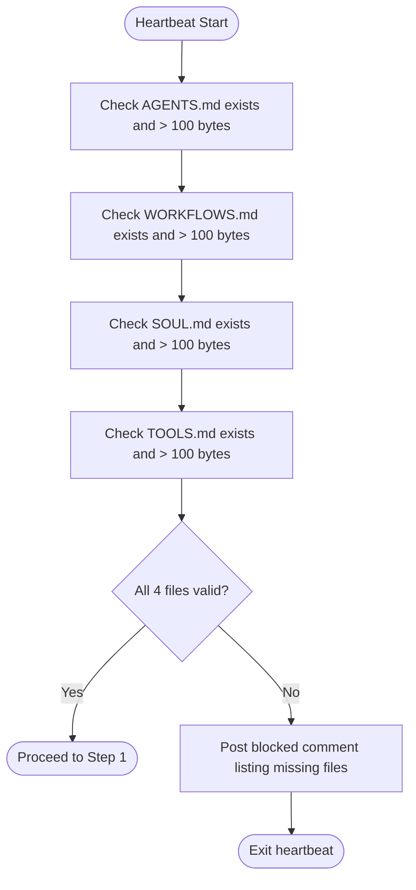
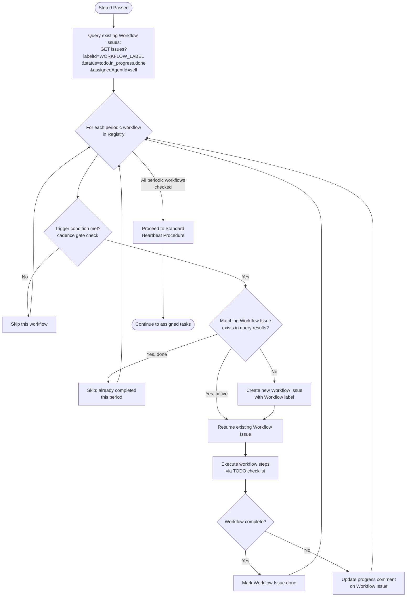
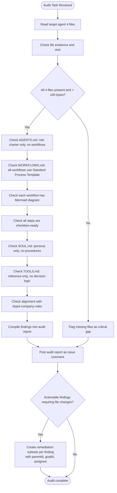
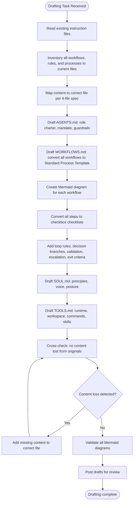
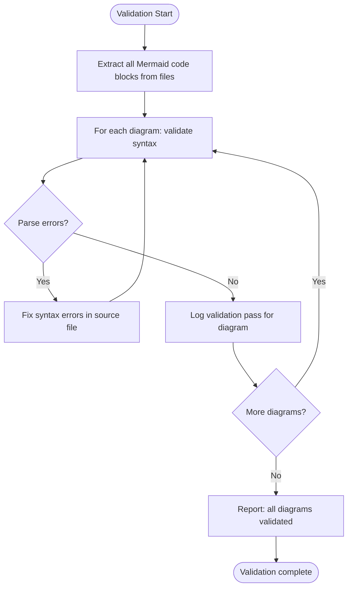
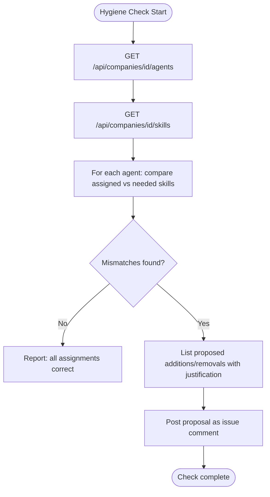
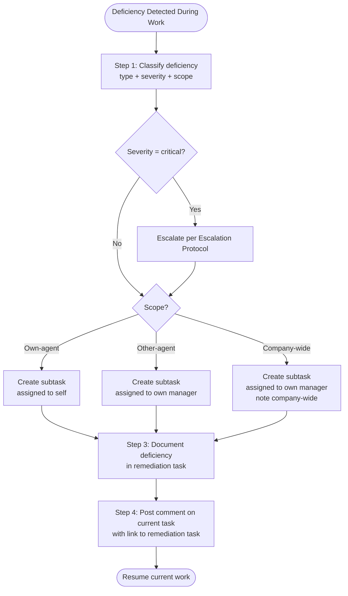
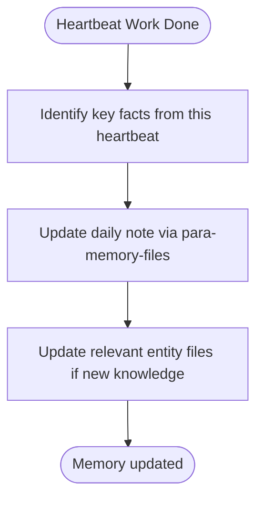

```mermaid
graph TD
    A([Step 0 Passed]) --> B[Step 1: Load identity via GET /api/agents/me]
    B --> C[Step 2: Load dspot-company-rules skill]
    C --> D[Step 3: Check wake reason and comment if mention-triggered]
    D --> D1{dependency_resolved?}
    D1 -- Yes --> D2[Set dependency-wake flag\nrecord LINKED_ISSUE_IDS]
    D2 --> E[Step 4: Get assignments via inbox-lite]
    D1 -- No --> E
    E --> E2{Step 4b: Board-assigned issues?\nassigneeUserId set,\nassigneeAgentId null}
    E2 -- Yes --> E3[Skip: board-assigned = blocked\nper company rules]
    E3 --> F{Any remaining assigned tasks?}
    E2 -- No --> F
    F -- No and no mention handoff --> G([Exit heartbeat])
    F -- Yes --> F1{dependency_resolved wake?}
    F1 -- Yes --> F2{Task status = blocked?}
    F2 -- Yes --> F3[GET /api/issues/TASK_ID/dependencies]
    F3 --> F4{All dependencies resolved?}
    F4 -- Yes --> F5[PATCH task: blocked to todo]
    F5 --> H[Step 5: Pick work - in_progress first, then todo]
    F4 -- No --> F6[Post partial resolution comment\nkeep blocked]
    F6 --> H
    F2 -- No --> H
    F1 -- No --> H
    H --> I[Step 6: Checkout task]
    I --> J{Checkout success?}
    J -- 409 Conflict --> K[Skip task, try next]
    K --> F
    J -- Success --> L[Step 7: Get heartbeat-context + comments]
    L --> M[Step 8: Do the work using domain workflows]
    M --> N[Step 9: Update status and comment]
    N --> N0a{Setting in_review?}
    N0a -- Yes --> N0b[Include wake-triggering mention\nof reviewer via agent:// URI]
    N0b --> N1a{Step 9a: Issue marked done?}
    N0a -- No --> N1a
    N1a -- Yes --> N1b[Check for blocked issues\nreferencing this as Blocked-By]
    N1b --> N1c{Dependents found?}
    N1c -- Yes --> N1d[Post resolution comment\non each dependent issue]
    N1d --> N2[Step 9b: Full task accounting -\nlist ALL assigned tasks with disposition]
    N1c -- No --> N2
    N1a -- No --> N2
    N2 --> O[Step 10: Fact extraction to PARA memory]
    O --> P([Exit heartbeat])
```

# Prompt Systems Engineer — Executable Procedures

## Workflow Registry

| # | Workflow Name | Type | Cadence | Trigger Condition | Batched With |
|---|---|---|---|---|---|
| 0 | Instruction Validation Gate | always | every-heartbeat | none (always) | -- |
| 1 | Master Heartbeat Orchestrator | always | every-heartbeat | Step 0 passed | -- |
| 2 | Instruction Bundle Audit | task-triggered | on-demand | assigned audit task | -- |
| 3 | Instruction File Drafting | task-triggered | on-demand | assigned drafting task | -- |
| 4 | Mermaid Diagram Validation | task-triggered | on-demand | after drafting/updating files | -- |
| 5 | Skill Assignment Hygiene Check | periodic | monthly | 1st heartbeat of month | -- |
| 6 | Fact Extraction and Memory Update | always | every-heartbeat | work was done this heartbeat | -- |
| 7 | Deficiency Detection and Remediation | event-triggered | on-detection | deficiency detected during work | -- |

**Workflow label ID:** `3b18b6d1-385b-48c2-8660-68b66433e9ec`
**Scheduled label ID:** `b87aa6aa-482e-4856-acde-40ed817d4360`

---

## Workflow: Instruction Validation Gate (Step 0)

**Objective:** Verify the agent's instruction bundle is complete before any work begins.
**Trigger:** Every heartbeat, first action.
**Preconditions:** Agent has been woken by Paperclip.
**Inputs:** File system access to own instructions/ directory.

### Mermaid Diagram

### Checklist

- [ ] Step 1: Verify AGENTS.md exists and is > 100 bytes — Evidence: file stat confirms
- [ ] Step 2: Verify WORKFLOWS.md exists and is > 100 bytes — Evidence: file stat confirms
- [ ] Step 3: Verify SOUL.md exists and is > 100 bytes — Evidence: file stat confirms
- [ ] Step 4: Verify TOOLS.md exists and is > 100 bytes — Evidence: file stat confirms
- [ ] Step 5: IF any file missing or empty: post blocked comment with file details, exit
- [ ] Step 6: ELSE: proceed to Standard Heartbeat

### Validation
- Manual check: all 4 files readable and > 100 bytes

### Blocked / Escalation
- If any file missing: post comment on current task, tag Technical Lead, exit heartbeat

### Exit Criteria
- All 4 files confirmed present and valid

---

## Workflow: Master Heartbeat Orchestrator

**Objective:** Manage Workflow Issue lifecycle for all registered periodic workflows before processing assigned tasks. Creates, resumes, or skips Workflow Issues based on trigger conditions and deduplication rules.
**Trigger:** Every heartbeat, after Step 0 passes, before Standard Heartbeat Procedure.
**Preconditions:** Instruction Validation Gate passed. Workflow label exists (id: `3b18b6d1-385b-48c2-8660-68b66433e9ec`).
**Inputs:** Workflow Registry Table, Paperclip API access, company ID.

### Mermaid Diagram

### Checklist

- [ ] Step 1: Query existing Workflow Issues — `GET /api/companies/{companyId}/issues?labelId=3b18b6d1-385b-48c2-8660-68b66433e9ec&status=todo,in_progress,done&assigneeAgentId={self}` — Evidence: issue list returned
- [ ] Step 2 (LOOP — each periodic workflow in Registry):
  - Check trigger condition (cadence gate: compare current date against last execution)
  - IF not triggered: skip, log "skipped: cadence not met"
  - IF triggered AND matching Workflow Issue exists (match by workflow name in title + current period): resume it
  - IF triggered AND no matching issue: create new Workflow Issue via `POST /api/companies/{companyId}/issues` with:
    - Title: `{Workflow Name} - {Period}` (e.g., "Skill Assignment Hygiene Check - 2026-04")
    - Labels: Workflow (`3b18b6d1-385b-48c2-8660-68b66433e9ec`) + Scheduled (`b87aa6aa-482e-4856-acde-40ed817d4360`) for periodic workflows without a parent
    - Description: **FULL workflow content from WORKFLOWS.md — mechanically copied, not regenerated.**
      Copy procedure:
      (a) Use the Read tool to load your own WORKFLOWS.md file.
      (b) Locate the target workflow section by its heading (pattern: `## Workflow: {Name}` or `### Workflow: {Name}`).
      (c) Extract from that heading through to the next horizontal rule (`---` or `***`) or the next workflow heading at the same or higher level — whichever comes first.
      (d) Use that exact extracted text as the issue description. Do NOT regenerate or summarize from memory.
      (e) **Post-creation validation:** After creating the Workflow Issue, re-read its description via `GET /api/issues/{id}` and verify these 9 section headers are ALL present: Objective, Trigger, Preconditions, Inputs, Mermaid Diagram, Checklist, Validation, Blocked/Escalation, Exit Criteria. If any are missing, immediately PATCH the description with the complete text from step (c).
    - Assignee: self
    - Goal: inherit from parent task if applicable
    - Parent: triggering task (if task-triggered) or none (if periodic/scheduled)
  - Execute workflow steps within the Workflow Issue context
  - IF matching issue exists with status `done` for current period: skip (already completed)
  - On completion: `PATCH /api/issues/{id}` with status `done` (do NOT set `hiddenAt` — hidden issues are invisible to API queries and break dedup)
  - Loop rule: inline checklist (PSE has 1 periodic workflow)
  - Evidence: per-workflow action (created/resumed/skipped)
- [ ] Step 3: Proceed to Standard Heartbeat Procedure for assigned task work — Evidence: handoff complete

### Validation
- Workflow Issues created with correct label, title format, and assignee
- No duplicate Workflow Issues for same workflow + period
- Completed Workflow Issues remain visible (status=done, NO hiddenAt) for audit trail and dedup

### Blocked / Escalation
- If Workflow label missing or deleted: recreate it via `POST /api/companies/{companyId}/labels`, then continue
- If API issues prevent Workflow Issue creation: log error, proceed to Standard Heartbeat (do not block assigned work)

### Exit Criteria
- All periodic workflows checked — Workflow Issues created, resumed, or skipped as appropriate
- Handoff to Standard Heartbeat Procedure complete

---

## Workflow: Standard Heartbeat Procedure

**Objective:** Execute the full heartbeat cycle from identity through work to exit. Runs after the Master Heartbeat Orchestrator has processed periodic workflows.
**Trigger:** Every heartbeat, after Master Heartbeat Orchestrator completes.
**Preconditions:** Instruction Validation Gate passed. Periodic workflows handled.
**Inputs:** Paperclip environment variables, assigned tasks.

### Mermaid Diagram

### Checklist

- [ ] Step 1: Call GET /api/agents/me — get id, companyId, role, chainOfCommand — Evidence: identity loaded
- [ ] Step 2: Load dspot-company-rules skill — Evidence: rules available in context
- [ ] Step 3: Check PAPERCLIP_WAKE_REASON and PAPERCLIP_WAKE_COMMENT_ID
  - IF `dependency_resolved`: set dependency-wake flag, record `PAPERCLIP_LINKED_ISSUE_IDS`
  - IF mention-triggered: fetch and respond to the triggering comment first
  - IF comment asks to take task: self-assign via checkout
  - IF comment asks for input only: respond in comments, continue
- [ ] Step 4: Call GET /api/agents/me/inbox-lite — Evidence: inbox response received
- [ ] Step 4b: Board-assignment guard — For each issue in inbox, check if `assigneeUserId` is set (board-assigned). Board-assigned issues are always blocked per company rules.
  - IF `assigneeUserId` is set AND `assigneeAgentId` is null: issue is board-assigned
    - Do NOT attempt to checkout or work on it
    - Skip it during work selection (treat as blocked)
    - IF status is not already `blocked`: flag in exit comment as anomaly (board-assigned but not blocked)
  - IF `assigneeUserId` is set AND `assigneeAgentId` is also set: normal agent assignment, process normally
  - Evidence: board-assigned issues identified and skipped
- [ ] Step 4c: Dependency re-evaluation (IF `PAPERCLIP_WAKE_REASON=dependency_resolved`)
  - IF task status is NOT `blocked`: skip (task already unblocked by different path)
  - Fetch `PAPERCLIP_TASK_ID` task dependencies: `GET /api/issues/{taskId}/dependencies`
  - Check each dependency's status (resolved = blocker issue status is `done` or `cancelled`)
  - IF all dependencies resolved:
    - `PATCH /api/issues/{taskId}` with `{"status": "todo", "comment": "All blocker dependencies resolved. Unblocking task.\n\nResolved: [list of resolved issue links]"}`
    - Include `X-Paperclip-Run-Id` header
    - Prioritize this task for work this heartbeat
  - IF some dependencies remain unresolved:
    - `POST /api/issues/{taskId}/comments` with acknowledgment of partial resolution
    - Keep task `blocked`; do NOT prioritize for work
  - Evidence: Dependencies checked, task transitioned or comment posted
- [ ] Step 5: Pick work — prioritize in_progress, then todo, skip blocked unless unblockable
  - IF PAPERCLIP_TASK_ID set and assigned to me: prioritize it
  - IF nothing assigned and no mention handoff: exit heartbeat
- [ ] Step 6: Call POST /api/issues/{id}/checkout with run ID header — Evidence: checkout success
  - IF 409 Conflict: skip task, never retry
- [ ] Step 7: Call GET /api/issues/{id}/heartbeat-context — read context, ancestors, comments
- [ ] Step 8: Execute domain work (see domain workflows below)
- [ ] Step 9: Update issue status via PATCH /api/issues/{id} with comment — Evidence: status updated
  - Set to `in_review` (not `done`) for completed domain work, with review-ready evidence in the comment. Use `done` only for housekeeping tasks (per Task Completion and Review Handoff rule)
  - IF setting `in_review` for work with a PR: the comment MUST include a wake-triggering mention of `[@DevSecFinOps Engineer](agent://ce6f0942-0925-4d84-a99f-aca6943effbe)` for code quality review. The `agent://` URI triggers the heartbeat wake. Profile links (`/DSPA/agents/...`) do NOT trigger wakes. For non-PR deliverables or escalation, identify the reviewer from `chainOfCommand`.
  - IF blocked: set status to blocked with blocker explanation before exiting
  - IF blocked AND blocker is another issue: include `Blocked-By: [ISSUE-ID](/DSPA/issues/ISSUE-ID)` on its own line per Dependency Declaration rule
  - IF blocked AND blocker is review/human-action (not an issue): describe in prose, do NOT use `Blocked-By:` format
- [ ] Step 9a: Dependency resolution notification (when marking issue done) — Evidence: resolution comments posted or "no dependents found"
  - Search for blocked issues that reference this issue in a `Blocked-By:` line
  - IF found: post a comment on each: `Blocker resolved: [ISSUE-ID](/DSPA/issues/ISSUE-ID) is now done.`
  - IF not found: log "no dependents found" in evidence
- [ ] Step 9b: Full task accounting — Evidence: exit comment posted with all-task disposition
  - **Full task accounting rule:** The final exit comment (on the primary worked task or as a standalone summary) MUST list EVERY assigned task from the inbox with its disposition:
    - **Progressed:** what was done this heartbeat and what remains
    - **Deferred:** explicitly state why (time constraint, deprioritized, dependency not met)
    - **Blocked:** blocker details and who needs to act
    - **Not started:** state reason (new assignment not yet reached, lower priority)
  - **Honest language rule:** Never use "all tasks addressed", "complete", or "done" unless tasks are literally finished (status=done) or explicitly blocked. Use precise language: "progressed", "deferred", "not started this heartbeat"
- [ ] Step 9c: **Stale `in_review` escalation** — During inbox scanning, if any task you own has been in `in_review` for more than 12 hours with no manager acknowledgment (no comment or status change), post a follow-up comment tagging the Technical Lead. Do NOT change the status — leave it as `in_review`. If no response after a second 12-hour window, escalate per the Escalation Protocol (Severity 2). — Evidence: Stale in_review items flagged or "none stale"
- [ ] Step 10: Extract facts to PARA memory via para-memory-files skill — Evidence: daily note updated

### Validation
- Manual check: comment posted on all in_progress tasks before exit
- Manual check: exit summary accounts for every assigned task in inbox (none silently omitted)
- If `dependency_resolved` wake: dependency re-evaluation completed with correct status transition

### Blocked / Escalation
- If blocked: PATCH status to blocked, comment with blocker details and who needs to act
- Escalate via chainOfCommand (Technical Lead first, then Director)

### Exit Criteria
- All in_progress tasks have an exit comment
- Status updates posted for all worked tasks
- Task status set to `in_review` for completed domain work (not `done`). `done` used only for housekeeping tasks.
- When setting `in_review` for PR work: comment includes wake-triggering mention of `[@DevSecFinOps Engineer](agent://ce6f0942-0925-4d84-a99f-aca6943effbe)` for code review. For non-PR deliverables, mention reviewer from `chainOfCommand`
- Exit summary includes disposition for every assigned task (no omissions)
- If `dependency_resolved` wake: blocked task transitioned to `todo` (all deps resolved) or kept `blocked` with partial-resolution comment

---

## Workflow: Instruction Bundle Audit

**Objective:** Audit one or more agent instruction files for quality, completeness, and alignment with the 4-file specification.
**Trigger:** When assigned an audit task, or as part of a company-wide instruction review.
**Preconditions:** Target agent's instruction files are accessible.
**Inputs:** Agent ID, instruction file paths.

### Mermaid Diagram

### Checklist

- [ ] Step 1: Read all 4 instruction files for the target agent — Evidence: files loaded
- [ ] Step 2: Verify file existence and size (each > 100 bytes) — Evidence: sizes confirmed
- [ ] Step 3: Audit AGENTS.md boundaries — no workflows, no tone, no tool paths — Evidence: findings listed
- [ ] Step 4: Audit WORKFLOWS.md — every workflow uses Standard Process Template — Evidence: template compliance noted
- [ ] Step 5: Check each workflow has a Mermaid diagram — Evidence: diagram count matches workflow count
- [ ] Step 6: Check all checklist steps are checkbox-ready (not prose) — Evidence: compliance noted
- [ ] Step 7: Check loop handling rules present (inline <=7, child tasks >7) — Evidence: loop rules found
- [ ] Step 8: Audit SOUL.md boundaries — no procedures, no tools — Evidence: findings listed
- [ ] Step 9: Audit TOOLS.md boundaries — no decision logic — Evidence: findings listed
- [ ] Step 10: Check alignment with dspot-company-rules — Evidence: rule violations listed or none
- [ ] Step 11: Compile findings and post audit report — Evidence: comment posted
- [ ] Step 12: Create remediation subtasks — For each actionable finding that requires a file change, create a subtask under the audit task with parentId, goalId, and assignee (self or target agent owner). Audit is NOT done until all follow-up tasks exist. — Evidence: subtask IDs listed, or "no actionable findings" noted

### Validation
- Manual review: audit report posted with specific findings per file
- Manual review: every actionable finding has a corresponding remediation subtask (or explicit justification for why not)

### Blocked / Escalation
- If target agent files inaccessible: post blocked comment, tag Technical Lead

### Exit Criteria
- Audit report posted as issue comment with per-file findings
- Remediation subtasks created for all actionable findings (with parentId and goalId set)

---

## Workflow: Instruction File Drafting

**Objective:** Draft or update instruction files for one agent following the 4-file specification.
**Trigger:** When assigned to create or update agent instruction files.
**Preconditions:** 4-file specification is available. Existing agent files have been read.
**Inputs:** Target agent identity, current instruction files, domain knowledge.

### Mermaid Diagram

### Checklist

- [ ] Step 1: Read all existing instruction files for target agent — Evidence: files loaded
- [ ] Step 2: Inventory every workflow, rule, process, guardrail in current files — Evidence: inventory list
- [ ] Step 3: Map each piece of content to correct file per specification — Evidence: mapping table
- [ ] Step 4: Draft AGENTS.md — Evidence: role charter complete, no workflows/tone/tools
- [ ] Step 5: Draft WORKFLOWS.md with all workflows in Standard Process Template — Evidence: all workflows converted
- [ ] Step 6: Create Mermaid diagram for each workflow — Evidence: diagram count matches workflow count
- [ ] Step 7: Convert all procedure steps to checkbox checklists — Evidence: no prose procedures
- [ ] Step 8: Add loop rules, decision branches, validation, escalation, exit criteria — Evidence: template sections complete
- [ ] Step 9: Draft SOUL.md — Evidence: persona complete, no procedures/tools
- [ ] Step 10: Draft TOOLS.md — Evidence: reference complete, no decision logic
- [ ] Step 11: Cross-check: verify no content from originals was lost — Evidence: diff review clean
- [ ] Step 12: Validate Mermaid diagrams render correctly — Evidence: validation passes
- [ ] Step 13: Post drafts for review — Evidence: documents posted

### Validation
- Cross-check: every rule/process/guardrail from originals present in new files
- Mermaid validation: all diagrams parse without errors

### Blocked / Escalation
- If domain knowledge insufficient: tag relevant domain agent or Technical Lead for input

### Exit Criteria
- All 4 files drafted, cross-checked, and posted for review

---

## Workflow: Mermaid Diagram Validation

**Objective:** Validate that Mermaid diagrams in instruction files parse and render correctly.
**Trigger:** After drafting or updating instruction files containing Mermaid.
**Preconditions:** Mermaid diagrams exist in target files.
**Inputs:** File paths containing Mermaid code blocks.

### Mermaid Diagram

### Checklist

- [ ] Step 1: Extract all Mermaid code blocks from target files — Evidence: block count noted
- [ ] Step 2 (LOOP — each diagram):
  - For each diagram: validate Mermaid syntax
  - IF parse error: fix and revalidate
  - ELSE: log pass
  - Loop rule: inline checklist if <=7 diagrams, child tasks if >7
  - Evidence: per-diagram validation result
- [ ] Step 3: Report all diagrams validated — Evidence: summary with pass/fail counts

### Validation
- All Mermaid code blocks parse without syntax errors

### Blocked / Escalation
- If Mermaid tooling unavailable: note in report, use manual syntax review

### Exit Criteria
- Every Mermaid diagram in the target files validates successfully

---

## Workflow: Skill Assignment Hygiene Check

**Objective:** Review skill assignments across all agents for correctness and propose changes.
**Trigger:** Periodic (monthly), or when instructed to audit skills.
**Preconditions:** Access to Paperclip API.
**Inputs:** Company agent list, company skills list.

### Mermaid Diagram

### Checklist

- [ ] Step 1: Fetch all agents via API — Evidence: agent list loaded
- [ ] Step 2: Fetch all company skills via API — Evidence: skills list loaded
- [ ] Step 3 (LOOP — each agent): Compare assigned vs needed skills — Evidence: per-agent assessment
  - Loop rule: inline checklist (<=7 active agents)
- [ ] Step 4: Compile mismatch report with justifications — Evidence: report drafted
- [ ] Step 5: Post proposal for Technical Lead review — Evidence: comment posted

### Validation
- Manual review: every proposed change has evidence-based justification

### Blocked / Escalation
- If API access issues: post blocked comment

### Exit Criteria
- Skill hygiene report posted with per-agent findings

---

## Workflow: Deficiency Detection and Remediation

**Objective:** When a deficiency is detected during work, create a tracked remediation task to ensure follow-up.
**Trigger:** Agent detects an instruction gap, process deficiency, rule violation, or configuration error during any heartbeat work.
**Preconditions:** Agent is executing a heartbeat and has found a deficiency.
**Inputs:** Deficiency details, current task context.

### Mermaid Diagram

### Checklist

- [ ] Step 1: Classify deficiency — type, severity, scope — Evidence: classification stated in task description
- [ ] Step 2: Create remediation task via `POST /api/companies/{companyId}/issues` with `parentId` and `goalId` — Evidence: task identifier returned
  - IF own-agent scope: `assigneeAgentId` = self
  - IF other-agent or company-wide scope: `assigneeAgentId` = own manager
  - IF critical severity: also escalate per Escalation Protocol
- [ ] Step 3: Document deficiency in remediation task description (what, why, proposed fix, discovering context link) — Evidence: description complete
- [ ] Step 4: Post comment on current task linking to remediation task — Evidence: comment posted with link

### Validation

- Every deficiency mentioned in comments has a corresponding remediation task with a link
- Remediation task has `parentId`, `goalId`, clear description, and assignee

### Blocked / Escalation

- If unable to create a task (API error): post deficiency details as a blocked comment on current task, escalate per Escalation Protocol

### Exit Criteria

- Remediation task created with `parentId`, `goalId`, assignee, and documented deficiency
- Comment posted on current task with link to remediation task

---

## Workflow: Fact Extraction and Memory Update

**Objective:** Extract key facts from the heartbeat and update PARA memory.
**Trigger:** End of every heartbeat, before exit.
**Preconditions:** Work was done during this heartbeat.
**Inputs:** Context from current heartbeat work.

### Mermaid Diagram

### Checklist

- [ ] Step 1: Identify key facts (decisions made, issues found, tasks completed) — Evidence: fact list
- [ ] Step 2: Update daily note with timeline entry — Evidence: daily note updated
- [ ] Step 3: IF new entities or significant knowledge: update PARA entity files — Evidence: entities updated

### Validation
- Manual check: daily note has entry for this heartbeat

### Blocked / Escalation
- If para-memory-files skill unavailable: note in exit comment

### Exit Criteria
- Daily note updated with heartbeat summary
