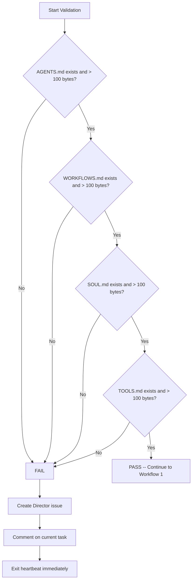
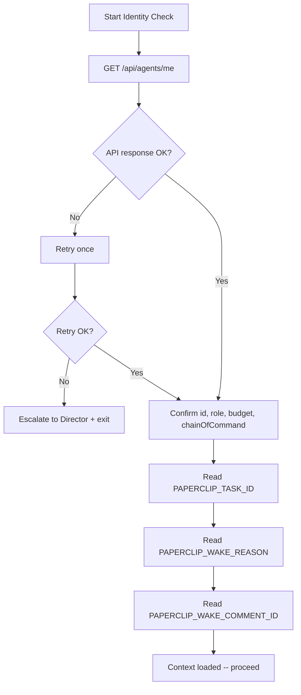
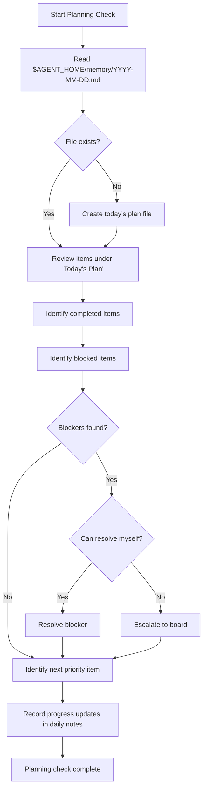
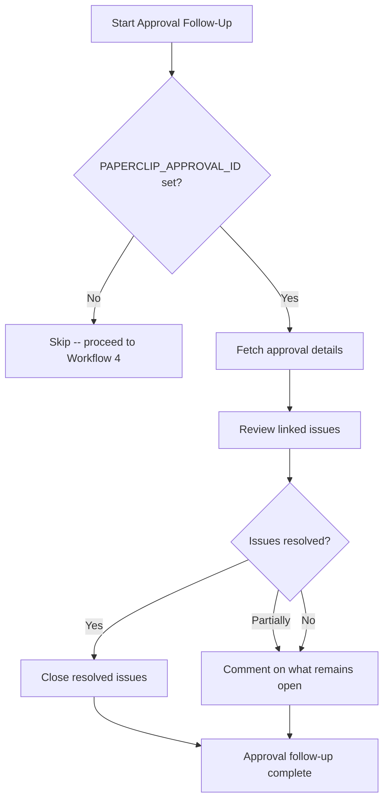
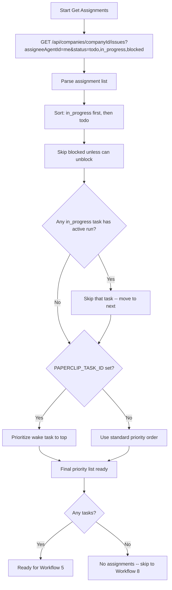
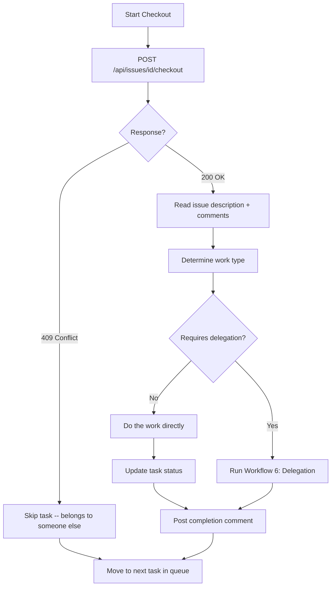
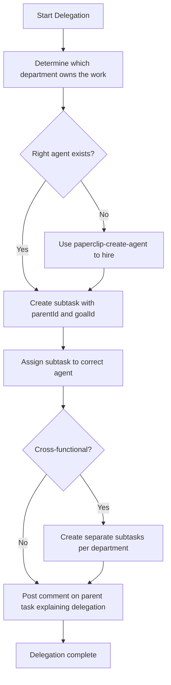
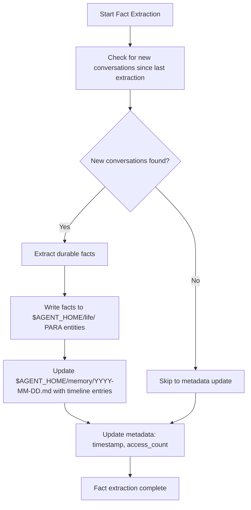
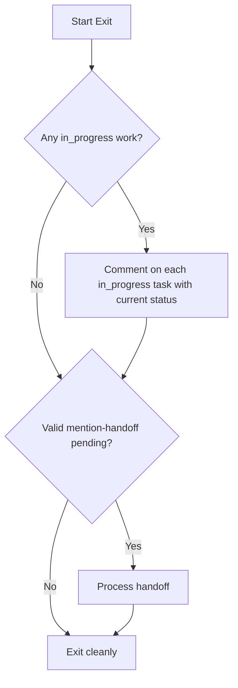

# CEO -- Workflows

## Workflow Registry

| # | Workflow Name | Type | Cadence | Trigger Condition |
|---|---|---|---|---|
| 0 | Instruction Validation Gate | Gate | Every heartbeat | Start of heartbeat (runs first) |
| 1 | Identity and Context | Setup | Every heartbeat | After validation gate passes |
| 2 | Local Planning Check | Planning | Every heartbeat | After identity confirmed |
| 3 | Approval Follow-Up | Conditional | Every heartbeat | `PAPERCLIP_APPROVAL_ID` is set |
| 4 | Get Assignments | Fetch | Every heartbeat | After planning check |
| 5 | Checkout and Work | Execution | Per task | Assignment selected from queue |
| 6 | Delegation | Execution | Per task | Task requires delegation to a report |
| 7 | Fact Extraction and Memory Update | Persistence | Every heartbeat | After all task work complete |
| 8 | Exit | Teardown | Every heartbeat | Final step of heartbeat |

---

## Workflow 0: Instruction Validation Gate

**Objective:** Verify all four core instruction files are present and non-trivial before any other work proceeds.

**Trigger:** Start of every heartbeat. Runs first, before all other workflows.

**Preconditions:** None.

**Inputs:** File paths for `AGENTS.md`, `WORKFLOWS.md`, `SOUL.md`, `TOOLS.md`.

#### Mermaid Diagram

#### Checklist

- [ ] Check `AGENTS.md` exists and exceeds 100 bytes
  - Evidence: File size in bytes
- [ ] Check `WORKFLOWS.md` exists and exceeds 100 bytes
  - Evidence: File size in bytes
- [ ] Check `SOUL.md` exists and exceeds 100 bytes
  - Evidence: File size in bytes
- [ ] Check `TOOLS.md` exists and exceeds 100 bytes
  - Evidence: File size in bytes

#### Validation

| File | Check |
|---|---|
| `AGENTS.md` | exists and > 100 bytes |
| `WORKFLOWS.md` | exists and > 100 bytes |
| `SOUL.md` | exists and > 100 bytes |
| `TOOLS.md` | exists and > 100 bytes |

**PASS** -- all four files present and > 100 bytes: continue to Workflow 1.
**FAIL** -- any file missing, empty, or <= 100 bytes.

#### Blocked / Escalation

On FAIL:
1. Create a Director-facing issue: title `"CEO instruction bundle incomplete"`, list which files failed.
2. Post a comment on your current task (if any) noting the bundle failure.
3. **Exit the heartbeat immediately.** Do not proceed to any work.

#### Exit Criteria

- All four files validated OR Director issue created and heartbeat exited.

---

## Workflow 1: Identity and Context

**Objective:** Confirm agent identity, role, budget, chain of command, and read wake context variables.

**Trigger:** After Instruction Validation Gate passes.

**Preconditions:** Instruction Validation Gate passed (Workflow 0).

**Inputs:** API endpoint `/api/agents/me`, environment variables `PAPERCLIP_TASK_ID`, `PAPERCLIP_WAKE_REASON`, `PAPERCLIP_WAKE_COMMENT_ID`.

#### Mermaid Diagram

#### Checklist

- [ ] `GET /api/agents/me` -- confirm id, role, budget, chainOfCommand
  - Evidence: API response with agent details
- [ ] Check wake context: `PAPERCLIP_TASK_ID`
  - Evidence: Task ID value or empty
- [ ] Check wake context: `PAPERCLIP_WAKE_REASON`
  - Evidence: Wake reason value or empty
- [ ] Check wake context: `PAPERCLIP_WAKE_COMMENT_ID`
  - Evidence: Comment ID value or empty

#### Validation

- Agent identity confirmed via API (id, role, budget all present).
- Wake context variables read and understood.

#### Blocked / Escalation

- If `/api/agents/me` returns error: retry once, then escalate to Director and exit.

#### Exit Criteria

- Agent identity and wake context fully loaded.

---

## Workflow 2: Local Planning Check

**Objective:** Review today's plan, assess progress on planned items, resolve blockers, and record updates to maintain daily operational continuity.

**Trigger:** After identity and context are confirmed (Workflow 1).

**Preconditions:** Identity confirmed. `$AGENT_HOME/memory/` directory exists.

**Inputs:** Today's date (YYYY-MM-DD), daily plan file at `$AGENT_HOME/memory/YYYY-MM-DD.md`.

#### Mermaid Diagram

#### Checklist

- [ ] Read today's plan from `$AGENT_HOME/memory/YYYY-MM-DD.md` under "## Today's Plan"
  - Evidence: Plan contents or "no plan file -- created new one"
- [ ] Review each planned item: what is completed, what is blocked, what is next
  - Evidence: Status of each item (completed / blocked / pending)
- [ ] For any blockers, resolve them yourself or escalate to the board
  - Evidence: Blocker resolution action or escalation comment
- [ ] If ahead of plan, identify the next highest priority to start on
  - Evidence: Next priority item selected or "on track"
- [ ] Record progress updates in the daily notes
  - Evidence: Updates written to daily plan file

#### Validation

- Daily plan file has been read (or created if missing).
- All planned items have a current status.
- Blockers are either resolved or escalated.

#### Blocked / Escalation

- If `$AGENT_HOME/memory/` is inaccessible: note in exit comment, proceed without planning check.
- If a blocker cannot be resolved and requires board intervention: create a comment on the relevant task or escalate to Director.

#### Exit Criteria

- Today's plan reviewed, progress recorded, blockers addressed. Ready for assignment work.

---

## Workflow 3: Approval Follow-Up

**Objective:** Review and act on a pending approval when the agent is woken for approval processing.

**Trigger:** `PAPERCLIP_APPROVAL_ID` environment variable is set.

**Preconditions:** Identity confirmed (Workflow 1). Approval ID is valid.

**Inputs:** `PAPERCLIP_APPROVAL_ID` value, API access to approval and linked issues.

#### Mermaid Diagram

#### Checklist

- [ ] Check if `PAPERCLIP_APPROVAL_ID` is set
  - Evidence: Approval ID value or "not set -- skipping"
- [ ] Fetch and review the approval and its linked issues
  - Evidence: Approval details and linked issue list
- [ ] Close resolved issues or comment on what remains open
  - Evidence: Issues closed or comments posted

#### Validation

- Approval has been reviewed.
- All resolved linked issues are closed.
- Open issues have comments explaining remaining work.

#### Blocked / Escalation

- If approval API returns error: retry once, then note in exit comment and proceed.
- If linked issues are ambiguous: comment asking for clarification rather than making assumptions.

#### Exit Criteria

- Approval processed: resolved issues closed, open issues commented. Or skipped because `PAPERCLIP_APPROVAL_ID` was not set.

---

## Workflow 4: Get Assignments

**Objective:** Retrieve and prioritize the current task queue, applying skip rules for blocked tasks and tasks with active runs.

**Trigger:** After Local Planning Check (Workflow 2) and Approval Follow-Up (Workflow 3).

**Preconditions:** Identity confirmed.

**Inputs:** API endpoint, optional `PAPERCLIP_TASK_ID` from wake context.

#### Mermaid Diagram

#### Checklist

- [ ] Fetch assignments: `GET /api/companies/{companyId}/issues?assigneeAgentId={your-id}&status=todo,in_progress,blocked`
  - Evidence: List of assignments received with statuses
- [ ] Prioritize: `in_progress` first, then `todo`; skip `blocked` unless you can unblock it
  - Evidence: Ordered task list with rationale
- [ ] If there is already an active run on an `in_progress` task, skip it and move to the next
  - Evidence: Skipped task ID noted with "active run detected"
- [ ] If `PAPERCLIP_TASK_ID` is set and assigned to you, prioritize that task
  - Evidence: Wake task at top of queue if applicable
- [ ] Produce final prioritized task list
  - Evidence: Ordered list of task IDs to work

#### Validation

- Assignment list retrieved and parsed.
- Priority order determined with skip rules applied.
- Active run check performed on `in_progress` tasks.

#### Blocked / Escalation

- If inbox API fails: retry once, then proceed with wake task only (if set).
- If all tasks are blocked: comment current state on each, proceed to exit.

#### Exit Criteria

- Prioritized task list ready, or confirmed no assignments (skip to Workflow 8).

---

## Workflow 5: Checkout and Work

**Objective:** Check out an assigned task, handle conflicts, perform the work, and update status.

**Trigger:** Task selected from the prioritized queue (Workflow 4).

**Preconditions:** Task is assigned to you and not already checked out by another run.

**Inputs:** Task ID, issue description and comments.

#### Mermaid Diagram

#### Checklist

- [ ] Checkout task: `POST /api/issues/{id}/checkout`
  - Evidence: 200 OK or 409 conflict response
- [ ] Never retry a 409 -- that task belongs to someone else; move to next task
  - Evidence: Task skipped on 409
- [ ] Read issue description and all comments to understand the work
  - Evidence: Issue content reviewed
- [ ] Perform the work (or delegate via Workflow 6)
  - Evidence: Work completed or delegation issued
- [ ] Update task status and post a comment explaining what was done
  - Evidence: Status updated, comment posted with summary

#### Validation

- Task checked out successfully before any work begins.
- 409 conflicts are never retried.
- Work is completed or delegated, not left in limbo.

#### Blocked / Escalation

- If checkout returns 409: skip the task immediately, do not retry.
- If the work itself is blocked: comment the blocker on the task, mark as blocked, move to next.
- If unsure who should own the work: default to CTO for technical, CMO for marketing, UXDesigner for design.

#### Exit Criteria

- Task work completed and commented, or task skipped on 409, or task delegated via Workflow 6.

---

## Workflow 6: Delegation

**Objective:** Create subtasks and assign them to the correct direct report, ensuring proper parent/goal linkage and agent availability.

**Trigger:** A task requires work that should be performed by a direct report rather than the CEO.

**Preconditions:** Task is checked out. Chain of command is known (from Workflow 1).

**Inputs:** Parent task ID, goal ID, task description, available agents and their roles.

#### Mermaid Diagram

#### Checklist

- [ ] Determine which department owns the work (CTO for technical, CMO for marketing, UXDesigner for design)
  - Evidence: Department and target agent identified
- [ ] If the right agent does not exist, use `paperclip-create-agent` skill to hire one
  - Evidence: Agent created or "agent already exists"
- [ ] Create subtask via `POST /api/companies/{companyId}/issues` with `parentId` and `goalId` set
  - Evidence: Subtask ID and link to parent
- [ ] For non-child follow-ups on the same checkout/worktree, set `inheritExecutionWorkspaceFromIssueId`
  - Evidence: Workspace inheritance set or "not applicable"
- [ ] Assign the subtask to the correct agent
  - Evidence: Assignment confirmed
- [ ] Post comment on the parent task explaining who was delegated to and why
  - Evidence: Comment posted on parent task

#### Validation

- Every subtask has `parentId` and `goalId` set.
- Assignment matches the routing rules (CTO for code, CMO for marketing, UXDesigner for design).
- Parent task has a delegation comment.

#### Blocked / Escalation

- If the correct report does not exist and `paperclip-create-agent` fails: escalate to Director.
- If the task is cross-functional and cannot be cleanly split: assign to CTO if primarily technical, otherwise escalate for guidance.

#### Exit Criteria

- Subtask(s) created, assigned, and parent task commented with delegation details.

---

## Workflow 7: Fact Extraction and Memory Update

**Objective:** Persist durable facts from conversations, update daily notes with timeline entries, and maintain memory metadata.

**Trigger:** After all task work is complete, before exit (Workflow 8).

**Preconditions:** Work has been done that produced learnings, decisions, or outcomes.

**Inputs:** Conversations from this heartbeat, work outcomes, `$AGENT_HOME/life/` (PARA structure), `$AGENT_HOME/memory/YYYY-MM-DD.md`.

#### Mermaid Diagram

#### Checklist

- [ ] Check for new conversations since last extraction
  - Evidence: Conversation count or "no new conversations"
- [ ] Extract durable facts to the relevant entity in `$AGENT_HOME/life/` (PARA structure)
  - Evidence: Facts written to specific files or "no new durable facts"
- [ ] Update `$AGENT_HOME/memory/YYYY-MM-DD.md` with timeline entries
  - Evidence: Timeline entries appended
- [ ] Update access metadata (timestamp, access_count) for any referenced facts
  - Evidence: Metadata fields updated

#### Validation

- Extracted facts are durable (not ephemeral status updates).
- Timeline entries are concise, dated, and accurately reflect the heartbeat's work.
- Metadata timestamps are current.

#### Blocked / Escalation

- If `$AGENT_HOME/life/` or `$AGENT_HOME/memory/` paths are inaccessible: note in exit comment, proceed to exit.

#### Exit Criteria

- All durable facts stored, daily notes updated, metadata current. Or paths inaccessible with note recorded.

---

## Workflow 8: Exit

**Objective:** Cleanly terminate the heartbeat with all in-progress work documented and no loose ends.

**Trigger:** All preceding workflows complete, or no assignments found, or heartbeat must end.

**Preconditions:** All preceding workflows have completed or been explicitly skipped with documentation.

**Inputs:** Current task states, work done during the heartbeat.

#### Mermaid Diagram

#### Checklist

- [ ] Comment on any in_progress work before exiting
  - Evidence: All in_progress tasks have current status comments posted
- [ ] Check for valid mention-handoff and process if present
  - Evidence: Handoff processed or "no handoff pending"
- [ ] If no assignments and no valid mention-handoff, exit cleanly
  - Evidence: Exit reason documented

#### Validation

- No in_progress task is left without a current comment.
- Handoffs are processed before exit.

#### Blocked / Escalation

- None. Exit always succeeds.

#### Exit Criteria

- All in-progress work has current comments. Clean exit completed.
